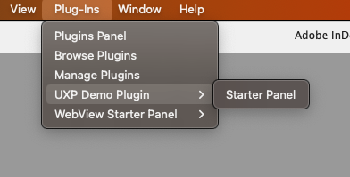

# Changelog
## InDesign v20.0
#### New
- [Flyout Menus Support](/src/pages/resources/recipes/flyout-menu/index.md)
- [Peristent Storage Migration](/src/pages/resources/recipes/persistent-storage-migration/index.md)
- [GUID support](/indesign/uxp/reference/uxp-api/reference-js/Modules/uxp/User%20Information/) 

## InDesign v19.2
#### Updated
- **[BREAKING CHANGE]** UXP logs and console.log [paths](/scripts/tutorials/debug/) have changed.

## InDesign v19.0

Plug-Ins menu lists the installed UXP plugins and their panel entrypoints.

  

#### Fixed

- Random app hang issue when invoking `doScript()` from UXP plugins.
- App crashes at quit when event handlers are registered.

### UXP v7.3.0 & UXP v7.2

#### New
- Multipart `FormData` support in [Request](/indesign/uxp/reference/uxp-api/reference-js/Global%20Members/Data%20Transfers/Request/) and [Response](/indesign/uxp/reference/uxp-api/reference-js/Global%20Members/Data%20Transfers/Response/) for [fetch](/indesign/uxp/reference/uxp-api/reference-js/Global%20Members/Data%20Transfers/fetch/)
- [FormData](/indesign/uxp/reference/uxp-api/reference-js/Global%20Members/Data%20Transfers/FormData/) now supports the following APIs
    - delete()
    - get()
    - getAll()
    - has()
    - keys()
    - set()
    - values()
- <b>(Photoshop Only)</b> GUID for uniquely identifying a Creative Cloud User.
- <b>(Photoshop Only)</b> Adobe Extensibility Metadata Platform (XMP) support.
- [pointer-events: none](https://developer.mozilla.org/en-US/docs/Web/CSS/pointer-events) `CSS` property
- Support for `pseudoElement` in [getComputedStyle(element, pseudoElement)](/indesign/uxp/reference/uxp-api/reference-js/Global%20Members/HTML%20DOM/getComputedStyle) API


#### Updated
- [FormData's append](/indesign/uxp/reference/uxp-api/reference-js/Global%20Members/Data%20Transfers/FormData.md#append--namevaluefilename) now supports `Blob` as an additional parameter.
- [Spectrum Web Component (SWC)](/indesign/uxp/reference/uxp-api/reference-spectrum/swc/) in UXP is moving out of Beta. 
    - Additional [components and variants](/indesign/uxp/reference/uxp-api/reference-spectrum/swc/index.md#list-of-supported-swc)
    - `Spectrum Web Components` support in `React` context is now available for all 30 components.
    - Starter plugins for [Spectrum Web Component](https://github.com/AdobeDocs/uxp-indesign-samples/tree/main/plugins/swc-uxp-starter) and [Spectrum Web Component in React context](https://github.com/AdobeDocs/uxp-indesign-samples/tree/main/plugins/swc-uxp-react-starter)

#### Fixed
- Tab Navigation not working for several SWC Components is now fixed
- Spacebar doesn't work on SWC Button component when reached via TAB navigation.
- Support for `Alerts`
    - [alert()](/indesign/uxp/reference/uxp-api/reference-js/Global%20Members/HTML%20DOM/alert/)
    - [prompt()](/indesign/uxp/reference/uxp-api/reference-js/Global%20Members/HTML%20DOM/prompt/)
    - [confirm()](/indesign/uxp/reference/uxp-api/reference-js/Global%20Members/HTML%20DOM/confirm/)


### UDT v2.0

#### New
- UXP Playground to experiment with APIs. Click on the 'Playground' tab next to 'Developer Workspace' to select an app and get started.

#### Updated
- Plugin actions are surfaced based on the 'Status' of your plugin in the Developer Workspace

## InDesign v18.5

UXP Plugins are now available! Get started [here](../plugins).

### UXP v7.1

#### New
HTMLElement now supports
- [setPointerCapture](/indesign/uxp/reference/uxp-api/reference-js/Global%20Members/HTML%20DOM/Element#setpointercapturepointerid)
- [releasePointerCapture](/indesign/uxp/reference/uxp-api/reference-js/Global%20Members/HTML%20DOM/Element#releasepointercapturepointerid)
- [hasPointerCapture](/indesign/uxp/reference/uxp-api/reference-js/Global%20Members/HTML%20DOM/Element#haspointercapturepointerid)
- [dir](/indesign/uxp/reference/uxp-api/reference-js/Global%20Members/HTML%20Elements/HTMLHtmlElement#dir--string)

#### Updated
- Documentation for `shell` moved to [new location](/indesign/uxp/reference/uxp-api/reference-js/Modules/uxp/shell/)

#### Fixed
- `SVGElement`: The color of the `fill` attribute using a CSS variable will resolve as per the variable value. For now, please test this fix by enabling the feature flag in your plugin manifest `"featureFlags" : { "enableFillAsCustomAttribute" : true }`. This flag will be turned on by default in the next UXP release. 
```
// CSS variable
html {
  --iconColor: yellow;
}

<svg height="100" width="100">
  <circle cx="50" cy="50" r="40" stroke="black" stroke-width="3" fill="var(--iconColor, red)" />
</svg>
// shows a yellow circle
```  

### UXP v7.0

#### New
- Support for Web Components in UXP Plugins. Various HTML elements and methods have been added to support this feature.
    - Classes
        - [HTMLSlotElement](/indesign/uxp/reference/uxp-api/reference-js/Global%20Members/HTML%20Elements/HTMLSlotElement/)
        - [HTMLTemplateElement](/indesign/uxp/reference/uxp-api/reference-js/Global%20Members/HTML%20Elements/HTMLTemplateElement/)
    - Methods
        - [Element.assignedSlot](/indesign/uxp/reference/uxp-api/reference-js/Global%20Members/HTML%20DOM/Element.md#assignedslot--htmlslotelement)
        - [Element.slot](/indesign/uxp/reference/uxp-api/reference-js/Global%20Members/HTML%20DOM/Element#slot--string)
        - [Element.attachShadow](/indesign/uxp/reference/uxp-api/reference-js/Global%20Members/HTML%20DOM/Element#attachshadowinit)
        - [Element.shadowRoot](/indesign/uxp/reference/uxp-api/reference-js/Global%20Members/HTML%20DOM/Element#shadowroot--shadowroot)
        - [CustomElementRegistry.upgrade](/indesign/uxp/reference/uxp-api/reference-js/Global%20Members/HTML%20DOM/CustomElementRegistry#upgraderoot)
        - [CustomElementRegistry.whenDefined](/indesign/uxp/reference/uxp-api/reference-js/Global%20Members/HTML%20DOM/CustomElementRegistry#whendefinedname)
- [Spectrum Web Components (Beta)](/indesign/uxp/reference/uxp-api/indesign/uxp/reference-spectrum/swc/) Support for Adobe SWC.
- Several augmentations to the JS API set
    - Properties
        - [HTMLElement.lang](/indesign/uxp/reference/uxp-api/reference-js/Global%20Members/HTML%20Elements/HTMLElement#lang--string)
    - Classes added to the global scope
        - [TreeWalker](/indesign/uxp/reference/uxp-api/reference-js/Global%20Members/HTML%20DOM/TreeWalker/)
        - [NodeFilter](/indesign/uxp/reference/uxp-api/reference-js/Global%20Members/HTML%20DOM/NodeFilter/)
    - Methods
        - [Element.hasAttributes](/indesign/uxp/reference/uxp-api/reference-js/Global%20Members/HTML%20DOM/Element#hasattributes)
        - [Element.getAttributeNames](/indesign/uxp/reference/uxp-api/reference-js/Global%20Members/HTML%20DOM/Element#getattributenames)
        - [Event.composed](/indesign/uxp/reference/uxp-api/reference-js/Global%20Members/HTML%20Events/Event#composed--boolean)
        - [Event.composedPath](/indesign/uxp/reference/uxp-api/reference-js/Global%20Members/HTML%20Events/Event#composedpath)
        - [DocumentFragment.append](/indesign/uxp/reference/uxp-api/reference-js/Global%20Members/HTML%20DOM/DocumentFragment#appendargs)
        - [DocumentFragment.querySelector](/indesign/uxp/reference/uxp-api/reference-js/Global%20Members/HTML%20DOM/DocumentFragment#queryselectorselector)
        - [DocumentFragment.querySelectorAll](/indesign/uxp/reference/uxp-api/reference-js/Global%20Members/HTML%20DOM/DocumentFragment#queryselectorallselector)
- New focus events to support React 16
    - [Focusin Event](https://developer.mozilla.org/en-US/docs/Web/API/Element/focusin_event)
    - [Focusout Event](https://developer.mozilla.org/en-US/docs/Web/API/Element/focusout_event)
- HTML [2D Canvas Support](/indesign/uxp/reference/uxp-api/reference-js/Global%20Members/HTML%20Elements/HTMLCanvasElement/) for basic shapes and styling.
- Alerts
    - [alert()](/indesign/uxp/reference/uxp-api/reference-js/Global%20Members/HTML%20DOM/alert/)
    - [prompt()](/indesign/uxp/reference/uxp-api/reference-js/Global%20Members/HTML%20DOM/prompt/)
    - [confirm()](/indesign/uxp/reference/uxp-api/reference-js/Global%20Members/HTML%20DOM/confirm/)
- Support for [pipeThrough](/indesign/uxp/reference/uxp-api/reference-js/Global%20Members/Streams/ReadableStream#pipeThroughtransform-options) and [tee](/indesign/uxp/reference/uxp-api/reference-js/Global%20Members/Streams/ReadableStream#tee) in [ReadableStream](/indesign/uxp/reference/uxp-api/reference-js/Global%20Members/Streams/ReadableStream). Refer to [Streams](/indesign/uxp/reference/uxp-api/reference-js/Global%20Members/Streams/) for more details
- [ImageBlob](/indesign/uxp/reference/uxp-api/reference-js/Global%20Members/ImageBlob/) to render an uncompressed image buffer in UXP

#### Changed
- [HTMLVideoElement](/indesign/uxp/reference/uxp-api/reference-js/Global%20Members/HTML%20Elements/HTMLVideoElement/): 'metadata' is the default value for `preload` attribute
- [FS API](/indesign/uxp/reference/uxp-api/reference-js/Modules/fs/): No need for the `file://` protocol


## InDesign v18.4

### InDesign APIs

#### Added
- **[BREAKING CHANGE]** Mounting APIs <br></br>
    InDesign DOM APIs are no longer available in the global scope. You must [mount the APIs](../recipes/dom-versioning/) first before using them. Plus, you can now access different versions of DOM APIs.
- Events <br></br>
    UXP scripts now have the functionality to handle standard events that InDesign emits. You can use the [eventListener](../recipes/events/)object to catch such events. 
- Arguments in UXP Scripts <br></br>
    [Arguments](../recipes/arguments/) can now be passed to a UXP script, and can be used within the script. 
- Setting script result <br></br>
    UXP scripts now have a "result" associated with them. [Set a result](../recipes/script-result/) for a script for debugging puposes as well as passed to another script for utilization.
- Menus <br></br>
    UXP scripts now have APIs which can be used to add new menu items, remove existing menu items etc. [Read more](../recipes/menus/).
