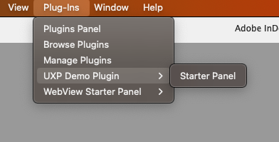

# Changelog
## InDesign v20.0
#### New
- [Flyout Menus Support](../resources/recipes/flyout-menu/index.md)
- [Peristent Storage Migration](../resources/recipes/persistent-storage-migration/index.md)
- [GUID support](/reference/uxp-api/reference-js/modules/uxp/user-information/index.md) 

### UXP v8.0.1

#### Breaking Changes
- `enableFillAsCustomAttribute` feature flag, introduced in UXP v7.1.0, will be turned on by default.

#### Deprecations
- Changes to Clipboard
  - [Clipboard.setContent](/reference/uxp-api/reference-js/global-members/data-transfers/clipboard.md#setcontentdata) is deprecated. Please use [Clipboard.write](/reference/uxp-api/reference-js/global-members/data-transfers/clipboard.md#writedata) instead.
  - [Clipboard.getContent](/reference/uxp-api/reference-js/global-members/data-transfers/clipboard.md#getcontent) is deprecated. Please use [Clipboard.read](/reference/uxp-api/reference-js/global-members/data-transfers/clipboard.md#read) instead.
  - Passing an `object` to [Clipboard.writeText(object)](/reference/uxp-api/reference-js/global-members/data-transfers/clipboard.md#writetexttext) is deprecated. Please use [Clipboard.write(object)](/reference/uxp-api/reference-js/global-members/data-transfers/clipboard.md#writedata) instead.
  - [Clipboard.clearContent](/reference/uxp-api/reference-js/global-members/data-transfers/clipboard.md#clearcontent) is deprecated. [Clipboard.writeText("")](/reference/uxp-api/reference-js/global-members/data-transfers/clipboard.md#writetexttext) would be an alternative.
- Changes to VideoElement
  - Event `uxpvideoload` in [load()](/reference/uxp-api/reference-js/global-members/html-elements/html-video-element.md#load) is deprecated. Use `loadeddata` instead.
  - Event `uxpvideoplay` in [play()](/reference/uxp-api/reference-js/global-members/html-elements/html-video-element.md#play) is deprecated. Use `ended` instead.
  - Event `uxpvideocomplete` in [play()](/reference/uxp-api/reference-js/global-members/html-elements/html-video-element.md#play) is deprecated. Use `ended` instead.
  - Event `uxpvideopause` in [pause()](/reference/uxp-api/reference-js/global-members/html-elements/html-video-element.md#pause) is deprecated. Use `pause` instead.

#### New
- New components supported in Spectrum Web Components (SWC). More details [here](https://github.com/adobe/swc-uxp-wrappers/tree/main?tab=readme-ov-file#spectrum-web-components-uxp-wrappers)
  - sp-asset
  - sp-meter
  - sp-number-field
  - sp-overlay
  - sp-quick-actions
  - sp-search
  - sp-swatch
- New command line templates to get started with SWC easily. Find details in this [section](/reference/uxp-api/reference-spectrum/swc/index.md#command-line-templates).
- Support for local HTML files in [WebView](/reference/uxp-api/reference-js/global-members/html-elements/html-web-view-element.md#load-local-content-onto-webview)
- New CSS capabilities
  - scaleX() & scaleY()
  - transform-origin
  - translate property
  - `Box-shadow` property now supports `transform rotate`.
- New feature flag `CSSNextSupport` in the manifest.json to gate the new and future CSS capability.

  | Manifest setting | Description  |
  | ---------------- | ------------ |
  | `featureFlags: {"CSSNextSupport": true}` | Enables all the new CSS features. |
  | `featureFlags: {"CSSNextSupport": ["boxShadow", "transformFunctions", "transformProperties" ]}` | Enables only the named properties in the list. |
  
  Note that `"enableSWCSupport": true` will enable `CSSNextSupport` by default, even if it is not done explicitly in plugin manifest otherwise.
- Video enhancements: Support added for [Seek Event](/reference/uxp-api/reference-js/global-members/html-elements/html-video-element.md)
- Support for [Navigator.language](https://developer.mozilla.org/en-US/docs/Web/API/Navigator/language) API
- Support for new HTMLElement APIs - [append](/reference/uxp-api/reference-js/global-members/html-elements/html-element.md#appendnodes), [prepend](/reference/uxp-api/reference-js/global-members/html-elements/html-element.md#prependnodes) and [replaceChildren](/reference/uxp-api/reference-js/global-members/html-elements/html-element.md#replacechildrennodes)
- [Beta] Support for form reset in [HTMLFormElement](https://developer.mozilla.org/en-US/docs/Web/HTML/Element/form)

#### Updated
- Upgraded Spectrum Web Components to v0.37.0. [More detail](https://github.com/adobe/swc-uxp-wrappers/tree/main?tab=readme-ov-file#spectrum-web-components-uxp-wrappers)
- [UXP Clipboard.writeText()](/reference/uxp-api/reference-js/global-members/data-transfers/clipboard.md#writetexttext) now accepts strings as input to meet standards

## InDesign v19.4

### UXP v7.4.0

#### Updated
- UXP Alerts ([alert](/reference/uxp-api/reference-js/global-members/html-dom/alert.md), [prompt](/reference/uxp-api/reference-js/global-members/html-dom/prompt.md), [confirm](/reference/uxp-api/reference-js/global-members/html-dom/confirm.md)) have been moved back to beta due to a few inherent instabilities in this feature. While we work on addressing these issues, the feature can be accessed using the feature flag `enableAlerts` in the manifest.json file. Also, note that UXP alerts will be `available only in Plugins` and `not in scripts`.
- Wildcards (*) at the top-level `domain` name are not allowed. Please ensure you revisit the `permissions` setup in manifest.json for [WebView](/reference/uxp-api/reference-js/global-members/html-elements/html-web-view-element.md), and network calls [XMLHttp](/reference/uxp-api/reference-js/global-members/data-transfers/xml-http-request.md) [fetch](/reference/uxp-api/reference-js/global-members/data-transfers/fetch.md)
- New doc for tracking the [mapping between Spectrum widgets and Spectrum Web Components](/reference/uxp-api/reference-spectrum/spectrum-widgets-to-swc-mapping/index.md) in UXP


#### Fixed
- XMP in Scripts.
- Plugin crashes while using [fit-content](https://forums.creativeclouddeveloper.com/t/ps-2024-crashes-when-opening-my-uxp-plugin/6840/7) 
- WebView support for [file selector](https://forums.creativeclouddeveloper.com/t/macos-uxp-webview-for-photoshop-is-missing-file-selector/6843) in MacOS
- GUID returning hashed empty string
- Updated missing docs for pseudo-class [defined](/reference/uxp-api/reference-css/pseudo-classes/defined.md) (Available since UXP v6.0)

## InDesign v19.2
#### Updated
- **[BREAKING CHANGE]** UXP logs and console.log [paths](/scripts/tutorials/debug/index.md) have changed.

## InDesign v19.0

Plug-Ins menu lists the installed UXP plugins and their panel entrypoints.

  

#### Fixed

- Random app hang issue when invoking `doScript()` from UXP plugins.
- App crashes at quit when event handlers are registered.

### UXP v7.3.0 & UXP v7.2

#### New
- Multipart `FormData` support in [Request](/reference/uxp-api/reference-js/global-members/data-transfers/request.md) and [Response](/reference/uxp-api/reference-js/global-members/data-transfers/response.md) for [fetch](/reference/uxp-api/reference-js/global-members/data-transfers/fetch.md)
- [FormData](/reference/uxp-api/reference-js/global-members/data-transfers/form-data.md) now supports the following APIs
    - delete()
    - get()
    - getAll()
    - has()
    - keys()
    - set()
    - values()
- **(Photoshop Only)** GUID for uniquely identifying a Creative Cloud User.
- **(Photoshop Only)** Adobe Extensibility Metadata Platform (XMP) support.
- [pointer-events: none](https://developer.mozilla.org/en-US/docs/Web/CSS/pointer-events) `CSS` property
- Support for `pseudoElement` in [getComputedStyle(element, pseudoElement)](/reference/uxp-api/reference-js/global-members/html-dom/get-computed-style.md) API


#### Updated
- [FormData's append](/reference/uxp-api/reference-js/global-members/data-transfers/form-data.md#append--namevaluefilename) now supports `Blob` as an additional parameter.
- [Spectrum Web Component (SWC)](/reference/uxp-api/reference-spectrum/swc/index.md) in UXP is moving out of Beta. 
    - Additional [components and variants](/reference/uxp-api/reference-spectrum/swc/index.md#list-of-supported-swc)
    - `Spectrum Web Components` support in `React` context is now available for all 30 components.
    - Starter plugins for [Spectrum Web Component](https://github.com/AdobeDocs/uxp-indesign-samples/tree/main/plugins/swc-uxp-starter) and [Spectrum Web Component in React context](https://github.com/AdobeDocs/uxp-indesign-samples/tree/main/plugins/swc-uxp-react-starter)

#### Fixed
- Tab Navigation not working for several SWC Components is now fixed
- Spacebar doesn't work on SWC Button component when reached via TAB navigation.
- Support for `Alerts`
    - [alert()](/reference/uxp-api/reference-js/global-members/html-dom/alert.md)
    - [prompt()](/reference/uxp-api/reference-js/global-members/html-dom/prompt.md)
    - [confirm()](/reference/uxp-api/reference-js/global-members/html-dom/confirm.md)


### UDT v2.0

#### New
- UXP Playground to experiment with APIs. Click on the 'Playground' tab next to 'Developer Workspace' to select an app and get started.

#### Updated
- Plugin actions are surfaced based on the 'Status' of your plugin in the Developer Workspace

## InDesign v18.5

UXP Plugins are now available! Get started [here](../plugins/index.md).

### UXP v7.1

#### New
HTMLElement now supports
- [setPointerCapture](/reference/uxp-api/reference-js/global-members/html-dom/element.md#setpointercapturepointerid)
- [releasePointerCapture](/reference/uxp-api/reference-js/global-members/html-dom/element.md#releasepointercapturepointerid)
- [hasPointerCapture](/reference/uxp-api/reference-js/global-members/html-dom/element.md#haspointercapturepointerid)
- [dir](/reference/uxp-api/reference-js/global-members/html-elements/html-html-element.md#dir--string)

#### Updated
- Documentation for `shell` moved to [new location](/reference/uxp-api/reference-js/modules/uxp/shell/index.md)

#### Fixed
- `SVGElement`: The color of the `fill` attribute using a CSS variable will resolve as per the variable value. For now, please test this fix by enabling the feature flag in your plugin manifest `"featureFlags" : { "enableFillAsCustomAttribute" : true }`. This flag will be turned on by default in the next UXP release. 
```
// CSS variable
html {
  --iconColor: yellow;
}

<svg height="100" width="100">
  <circle cx="50" cy="50" r="40" stroke="black" stroke-width="3" fill="var(--iconColor, red)" />
</svg>
// shows a yellow circle
```  

### UXP v7.0

#### New
- Support for Web Components in UXP Plugins. Various HTML elements and methods have been added to support this feature.
    - Classes
        - [HTMLSlotElement](/reference/uxp-api/reference-js/global-members/html-elements/html-slot-element.md)
        - [HTMLTemplateElement](/reference/uxp-api/reference-js/global-members/html-elements/html-template-element.md)
    - Methods
        - [Element.assignedSlot](/reference/uxp-api/reference-js/global-members/html-dom/element.md#assignedslot--htmlslotelement)
        - [Element.slot](/reference/uxp-api/reference-js/global-members/html-dom/element.md#slot--string)
        - [Element.attachShadow](/reference/uxp-api/reference-js/global-members/html-dom/element.md#attachshadowinit)
        - [Element.shadowRoot](/reference/uxp-api/reference-js/global-members/html-dom/element.md#shadowroot--shadowroot)
        - [CustomElementRegistry.upgrade](/reference/uxp-api/reference-js/global-members/html-dom/custom-element-registry.md#upgraderoot)
        - [CustomElementRegistry.whenDefined](/reference/uxp-api/reference-js/global-members/html-dom/custom-element-registry.md#whendefinedname)
- [Spectrum Web Components (Beta)](/reference/uxp-api/reference-spectrum/swc/index.md) Support for Adobe SWC.
- Several augmentations to the JS API set
    - Properties
        - [HTMLElement.lang](/reference/uxp-api/reference-js/global-members/html-elements/html-element.md#lang--string)
    - Classes added to the global scope
        - [TreeWalker](/reference/uxp-api/reference-js/global-members/html-dom/tree-walker.md)
        - [NodeFilter](/reference/uxp-api/reference-js/global-members/html-dom/node-filter.md)
    - Methods
        - [Element.hasAttributes](/reference/uxp-api/reference-js/global-members/html-dom/element.md#hasattributes)
        - [Element.getAttributeNames](/reference/uxp-api/reference-js/global-members/html-dom/element.md#getattributenames)
        - [Event.composed](/reference/uxp-api/reference-js/global-members/html-events/event.md#composed--boolean)
        - [Event.composedPath](/reference/uxp-api/reference-js/global-members/html-events/event.md#composedpath)
        - [DocumentFragment.append](/reference/uxp-api/reference-js/global-members/html-dom/document-fragment.md#appendargs)
        - [DocumentFragment.querySelector](/reference/uxp-api/reference-js/global-members/html-dom/document-fragment.md#queryselectorselector)
        - [DocumentFragment.querySelectorAll](/reference/uxp-api/reference-js/global-members/html-dom/document-fragment.md#queryselectorallselector)
- New focus events to support React 16
    - [Focusin Event](https://developer.mozilla.org/en-US/docs/Web/API/Element/focusin_event)
    - [Focusout Event](https://developer.mozilla.org/en-US/docs/Web/API/Element/focusout_event)
- HTML [2D Canvas Support](/reference/uxp-api/reference-js/global-members/html-elements/html-canvas-element.md) for basic shapes and styling.
- Alerts
    - [alert()](/reference/uxp-api/reference-js/global-members/html-dom/alert.md)
    - [prompt()](/reference/uxp-api/reference-js/global-members/html-dom/prompt.md)
    - [confirm()](/reference/uxp-api/reference-js/global-members/html-dom/confirm.md)
- Support for [pipeThrough](/reference/uxp-api/reference-js/global-members/streams/readable-stream.md#pipeThroughtransform-options) and [tee](/reference/uxp-api/reference-js/global-members/streams/readable-stream.md#tee) in [ReadableStream](/reference/uxp-api/reference-js/global-members/streams/readable-stream.md). Refer to [Streams](/reference/uxp-api/reference-js/global-members/streams/index.md) for more details
- [ImageBlob](/reference/uxp-api/reference-js/global-members/image-blob/index.md) to render an uncompressed image buffer in UXP

#### Changed
- [HTMLVideoElement](/reference/uxp-api/reference-js/global-members/html-elements/html-video-element.md): 'metadata' is the default value for `preload` attribute
- [FS API](/reference/uxp-api/reference-js/modules/fs/index.md): No need for the `file://` protocol


## InDesign v18.4

### InDesign APIs

#### Added
- **[BREAKING CHANGE]** Mounting APIs 
    InDesign DOM APIs are no longer available in the global scope. You must [mount the APIs](../resources/fundamentals/dom-versioning/index.md) first before using them. Plus, you can now access different versions of DOM APIs.
- Events 
    UXP scripts now have the functionality to handle standard events that InDesign emits. You can use the [eventListener](../resources/recipes/indesign-events/index.md)object to catch such events. 
- Arguments in UXP Scripts 
    [Arguments](../scripts/tutorials/arguments/index.md) can now be passed to a UXP script, and can be used within the script. 
- Setting script result 
    UXP scripts now have a "result" associated with them. [Set a result](../scripts/tutorials/script-result/index.md) for a script for debugging puposes as well as passed to another script for utilization.
- Menus 
    UXP scripts now have APIs which can be used to add new menu items, remove existing menu items etc. [Read more](../resources/recipes/indesign-menus/index.md).
