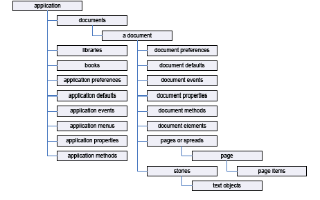

# Understanding the InDesign object model

This page goes over how the InDesign object modal in more detail. (TODO: add more info)

When you think about InDesign and InDesign documents, you probably organize the program and its components in your mind. You know that paragraphs are contained by text frames which, in turn, appear on a page. A page is a part of a spread, and one or more spreads make up a document. Documents contain colors, styles, layers, and master spreads. As you think about the layouts you create, you intuitively understand that there is an order to them.

InDesign "thinks" about the contents of a document in the same way. A document contains pages which contain page items (text frames, rectangles, ellipses, and so on). Text frames contain characters, words, paragraphs, and anchored frames; graphics frames contain images, EPS files, or PDF files; and groups have other page items. The things we mention here are the objects that make up an InDesign publication, and they are what we work with when we write InDesign scripts.

Objects in your publication are arranged in a specific order: frames are on pages, which are inside a document, which is inside the InDesign application object.We are talking about this structure when we speak of an object model or a hierarchy. Understanding the object model is the key to finding the object you want to work with, and your best guide to InDesign scripting is your knowledge of InDesign itself.

Objects have properties (attributes). For example, the properties of a text object include the font used to format the text, the point size, and the leading applied to the text.

Properties have values; for example, the point size of text can be either a number (in points) or the string "Auto" for auto leading. The fill color property of text can be set to a color, a gradient, a mixed ink, or a swatch.

Properties also can be read/write or read-only. Read/write properties can be set to other values; read-only properties cannot.

Objects also have methods - the verbs of the scripting world or the actions an object can perform. For example, the document object has print, export, and save methods.

Methods have parameters or values that define the effect of the method. For example, the place method of a document has a parameter that defines the file you want to place. Parameters can be required or optional, depending on the method.

The following figure is an overview of the InDesign object model. The diagram isn't a comprehensive list of the objects available to InDesign scripting; instead, it's a conceptual framework for understanding the relationships between the types of objects.

The objects in the diagram are explained in the following table:

| Term | What it represents
| --- | --- 
| Application | InDesign.
| Application defaults | Application default settings, such as colors, paragraph styles, and object styles. Application defaults affect all new documents. 
(TODO: complete table)