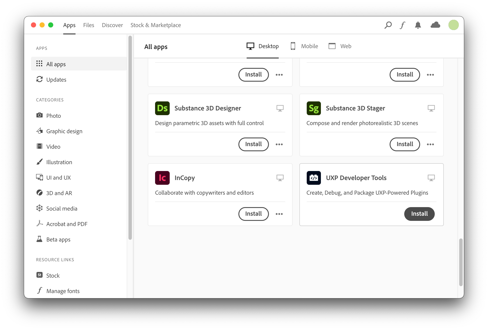
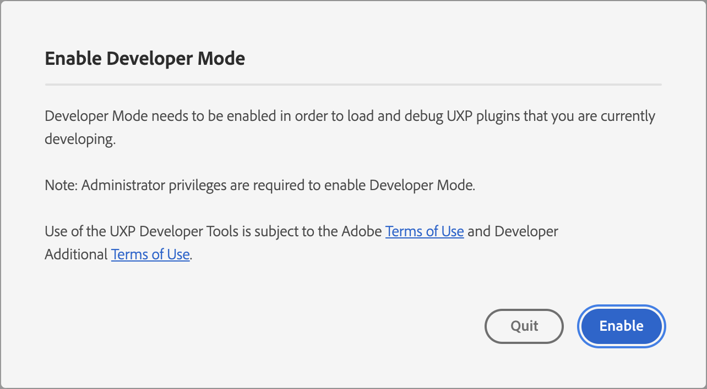
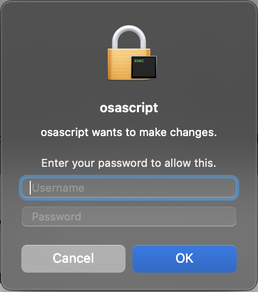

# Developer Tools

While writing UXP scripts and plugins, the following tools will make your job easier.

## Code Editor
A good text editor is necessary for you to organize your project effectively. Any modern developer-friendly text editor should work, but one of the popular choices is [Visual Studio Code](https://code.visualstudio.com), which has deep integrations with the other pieces needed for UXP, and a wide variety of its plugins to help with code formatting, syntax checking, JSON parsing, and so on.


## UXP Developer Tool (UDT)

The Adobe UXP Developer Tool (UDT) makes it easy to create, load, manage, and debug UXP-based plugins and scripts for UXP-powered applications. 

Additionally, for plugins, 
- It also lets you create a `.ccx` - A UXP plugin package ready for distribution.
- And offers a variety of easy-to-use templates and samples, to begin with.

<InlineAlert variant="info" slots="text"/>

**IMPORTANT**:
The Adobe UXP Developer Tool requires elevated privileges to function correctly. If your administrator does not enable your ability to elevate to Administrator privileges, you'll be unable to use this tool.

### Installation
Install UDT by clicking [here](https://creativecloud.adobe.com/apps/download/uxp-developer-tools) or by following these steps:
1. Launch Adobe Creative Cloud Application. If not installed, [download and install Creative Cloud](https://creativecloud.adobe.com/apps/download/creative-cloud).
2. Sign in with your Adobe account if not already signed in.
3. Click on `All apps` section, and you should see "UXP Developer Tools" listed.
  
4. Click on the `Install` button for the `UXP Developer Tools` card to start the installation.

### Launching for the first time

When you launch the Developer Tool for the first time, you'll be prompted to enable Developer Mode. This is required for you to load plugins in development into the application.



Once you click `Enable`, elevated permissions will be requested, and you may be required to enter your password or approve an action from the Developer Tool.

 

If you have problems with this step, you can also configure Developer Mode manually, although you must have Administrative privileges to do so:
1. Quit the UXP Developer Tool
2. Navigate to `/Library/Application Support/Adobe/UXP/Developer` on macOS, or `%CommonProgramFiles%/Adobe/UXP/Developer` on Windows. (If the folder does not exist, you can create it -- you'll need administrative rights.)
3. Create a new file named `settings.json` with the following contents (You'll need administrative rights to save the file):
    ```json
    {"developer" : true}
    ```
4. Launch the UXP Developer Tool again.

For now, successfully installing UDT is sufficient. We will understand UDT in more depth, once you write your first script or plugin. 

<!--
TODO Add this section once details are available
## Type definitions
Provide download link for UXP and InDesign 
-->
