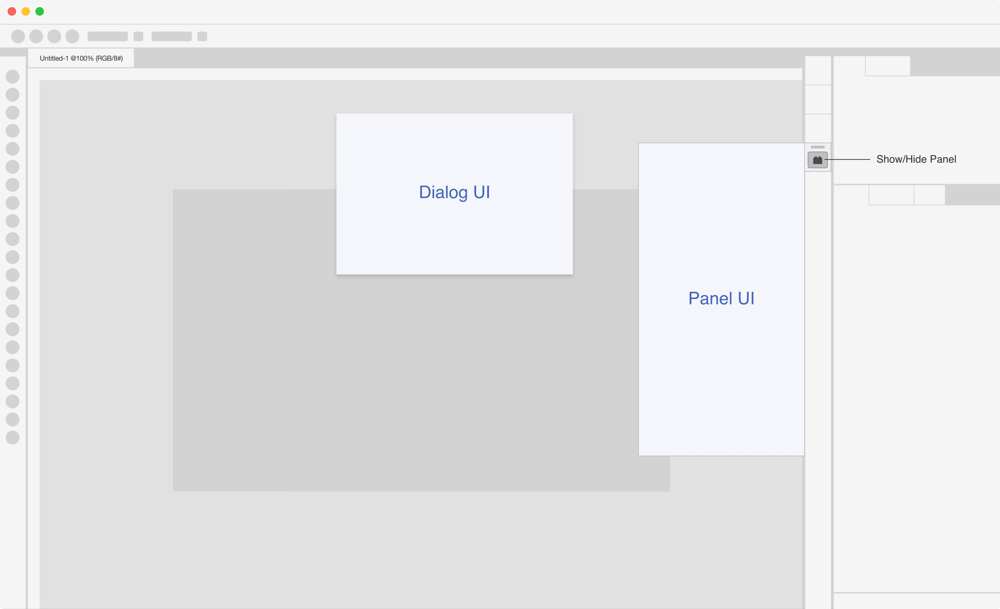

# UXP Entry Points

Plugins can have multiple entry points. An entrypoint is a way for a plugin to be invoked.

There are two types of entry points: `commands` and `panels`. 

- Commands are _"run and forget"_ entry points that are invoked by the user, such as a menu item or a keyboard shortcut. 
- Panels have a panel that can be opened by the user from the UI. The user can then interact with the panel.

The main difference between the two is that panels can have a persistent UI. Commands are invoked and then disappear.

However, both commands and panels can show modal dialogs. Modal dialogs are a special type of UI that blocks the user from interacting with the rest of the application until the dialog is closed. Modal dialogs are useful for getting information from the user.

