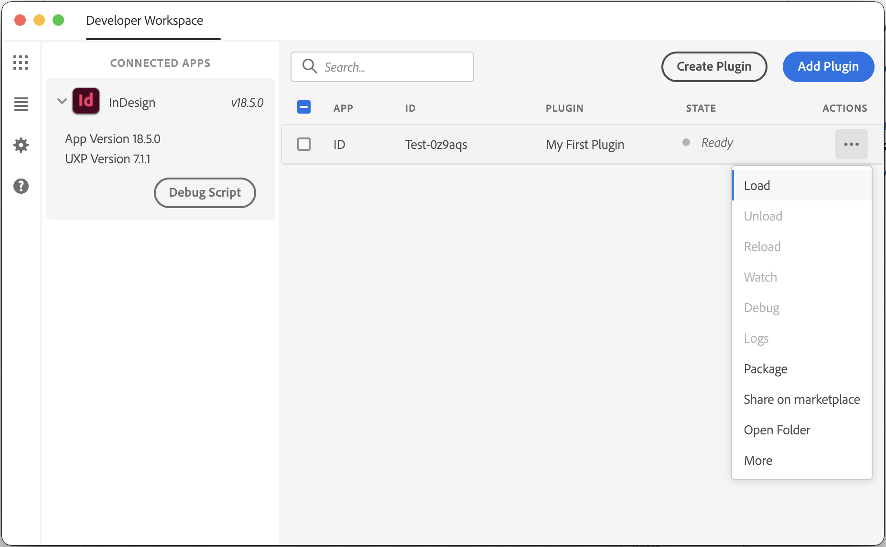
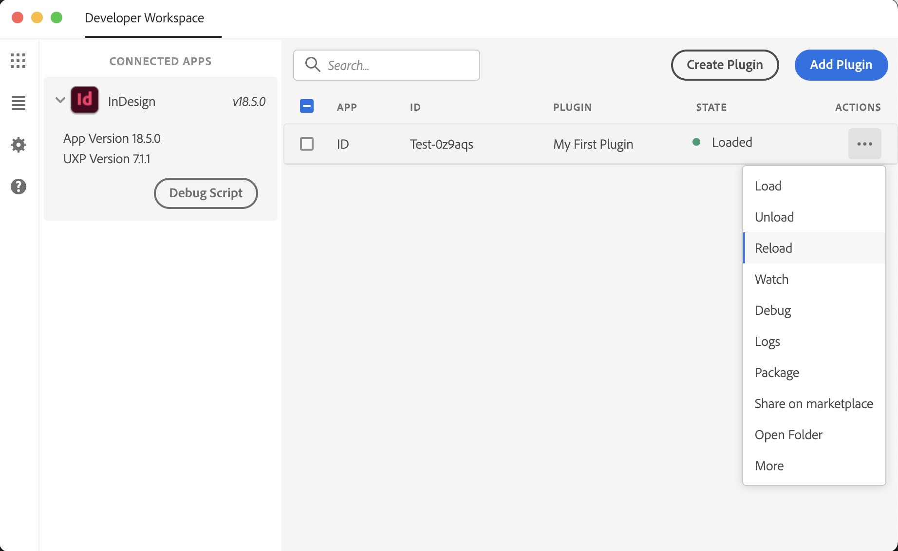

# Building your first plugin

This tutorial will walk you through the process of building your first plugin. You will learn how to create a plugin, add a command to it, and then run it in InDesign.

## Prerequisites

Before you start, make sure you have the following software installed on your machine:

- **InDesign 2023 (v18.5)** or later (can be installed from the _Creative Cloud Desktop_ app)
- **UXP Developer Tool v1.9** (can be [installed from the _Creative Cloud Desktop_ app](https://creativecloud.adobe.com/apps/download/uxp-developer-tools))
- A **code editor** of your choice (for example, [Visual Studio Code](https://code.visualstudio.com/))

## Steps

### Step 1: Create a plugin

You can create your plugin directly in the UXP Developer Tool. To do so, open the UXP Developer Tool and click **Create Plugin**.

This opens a dialog where you can enter the details for your plugin:

<figure>
  
  <figcaption>The create plugin dialog</figcaption>
</figure>

In the dialog, enter the following information:

| Field                    | Value             |
|--------------------------|-------------------|
| Name                     | My First Plugin   |
| Host Application         | Adobe InDesign    |
| Host Application Version | 18.5              |
| Template                 | indesign-quick-starter     |

Then click **Select Folder** and choose a location on your machine where you want to create the plugin.

The UXP Developer Tool will create a new folder with the name you specified in the location you specified. The folder will contain the following files:

```
My First Plugin
├── manifest.json
├── index.html
└── index.js
```

### Step 2: Run the plugin

Now that you have created your plugin, you can run it in InDesign.

First things first, you'll need to run InDesign. You can verify that UDT is connected to the app by checking the connected apps panel.

Then, in the UXP Developer Tool, in the row for your plugin, click **⋯ &rarr; Load**:

<figure>
  
  <figcaption>The load button</figcaption>
</figure>

This will load your plugin into InDesign. You should see the plugin's panel appear in InDesign:

<figure>
  
  <figcaption>The plugin panel</figcaption>
</figure>

### Step 3: Make a change

Now that you have your plugin running in InDesign, let's make this plugin your own.

Open the `index.html` file in your code editor. You should see the following code:

```html
<html>
  <head>
    <script src="./index.js"></script>
  </head>
  <body>
    <h1>Hello World!</h1>
    <button id="btnCreateText">Create Text</button>
  </body>
</html>
```

This is the HTML code that defines the content of your plugin's panel. You can change it to whatever you want.

For example, you could change the heading to say "My First Plugin":

```html
<h1>My First Plugin</h1>
```

Or you could add a paragraph below the heading:

```html
<p>This is my first plugin.</p>
```

To see your changes, you'll need to reload the plugin in InDesign. To do so, in the UXP Developer Tool, in the row for your plugin, click **⋯ &rarr; Reload**:

<figure>
  
  <figcaption>The reload button</figcaption>
</figure>

<InlineAlert slots="text" />

If you make any changes to the `manifest.json` file, you'll need to fully unload and reload the plugin. To do so, in the UXP Developer Tool, in the row for your plugin, click **⋯ &rarr; Unload** and **⋯ &rarr; Load**:


## Next steps

Congratulations! You have successfully created your first plugin. Next, we'll take a look at some of the concepts that are important for plugin development.
