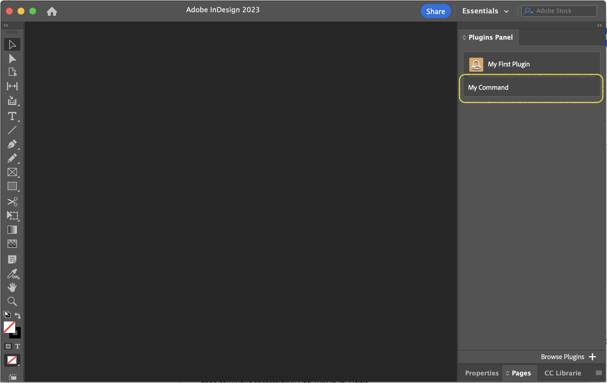

# Adding command entrypoints to your plugin

Command entrypoints are the most common type of entrypoint. They allow you to add commands to the InDesign user interface. When the user runs a command, your plugin can perform a variety of actions, such as opening a dialog and changing the document.

## Adding a command entrypoint to the manifest

In your `manifest.json` file, register a new `command`-type entrypoint:

```json
{
    // ...
    entrypoints: [
        {
            type: "command",
            id: "myCommand",
            label: "My Command",
        }
    ]
}
```

This will add a new command entrypoint with the ID `"myCommand"` (this will be important later) to your plugin. It will show up as _My Command_ in the InDesign user interface.

## Adding a function to handle the command

Now, we need some code that gets run when the command gets triggered. In your `index.js` file, add a function to handle the command:

```js
function myCommandHandler() {
    // Do something
}
```

Note that the name of the function doesn't matter. You can name it whatever you want.

## Associating the command entrypoint with the command handler

There are two ways to add a command entrypoint to your plugin's code.

### Method 1: Setup entrypoints using the UXP API

In your JavaScript code (for example, in your `index.js`, add the following code:

```js
const { entrypoints } = require("uxp");

entrypoints.setup({
    commands: {
        myCommand: myCommandHandler
    }
});
```

Note that `myCommand` is the ID of the command entrypoint we registered in the manifest.

<InlineAlert slots="text" />

You can only call `entrypoints.setup()` once. If you call it more than once, it will throw an error. If you need to add more entrypoints, you need to add them all at once.

### Method 2: JavaScript-based main file

Another method you can use that's especially useful for smaller plugins that only contain command entrypoints is to use a JavaScript-based main file (instead of an HTML file).

To do so, in your `manifest.json` file, set the `main` property to the path of your `index.js` file:

```json
{
    // ...
    main: "index.js",
    // ...
}
```

Then, in your `index.js` file, add the following code:

```js
module.exports = {
    commands: {
        myCommand: myCommandHandler
    }
};
```

Note that `myCommand` is the ID of the command entrypoint we registered in the manifest.

Now, the HTML file is no longer needed. You can delete it. This is especially useful when converting scripts to plugins.

## Conclusion

That's it! You've added a command entrypoint to your plugin. When you now load your plugin, you should see a new command called _My Command_ in the **Plugins** menu:

<figure>
  
  <figcaption>The My Command menu item</figcaption>
</figure>

When you click on it, the `myCommandHandler()` function will run.
