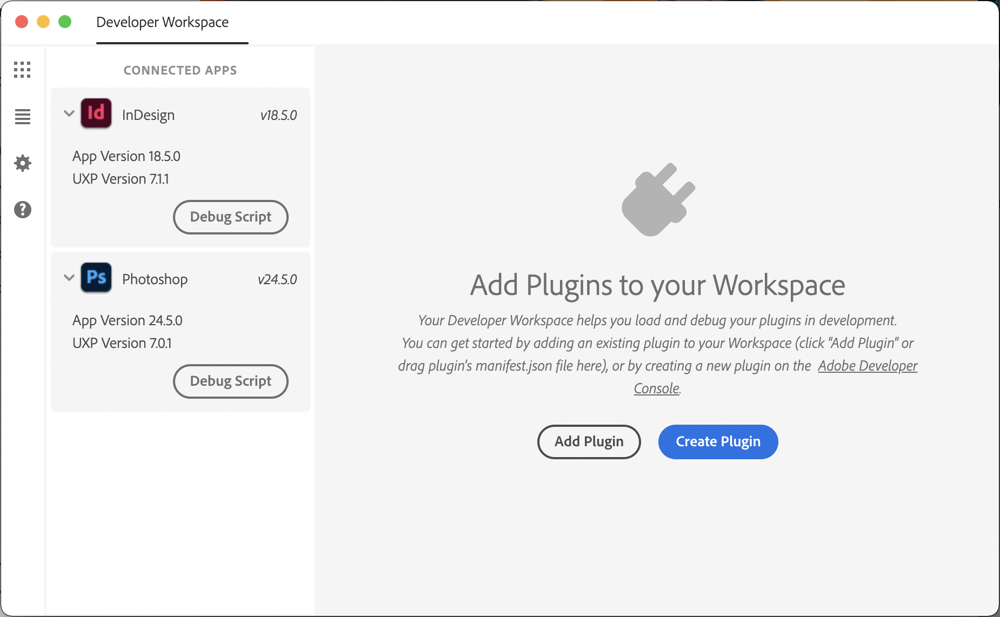
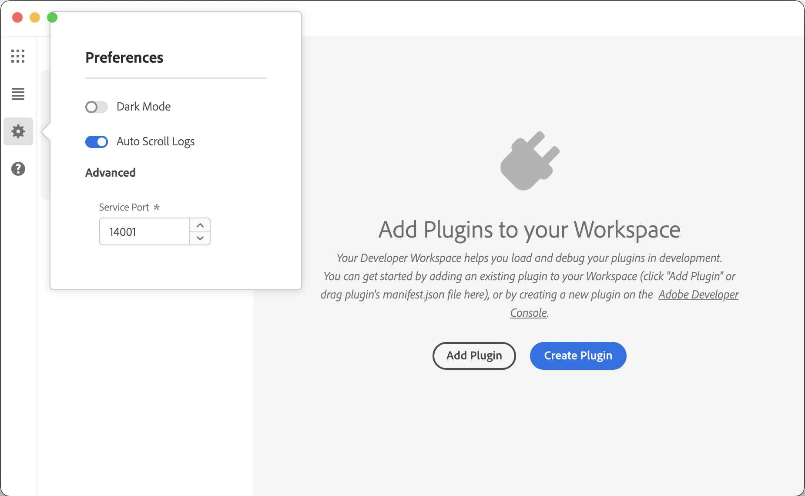
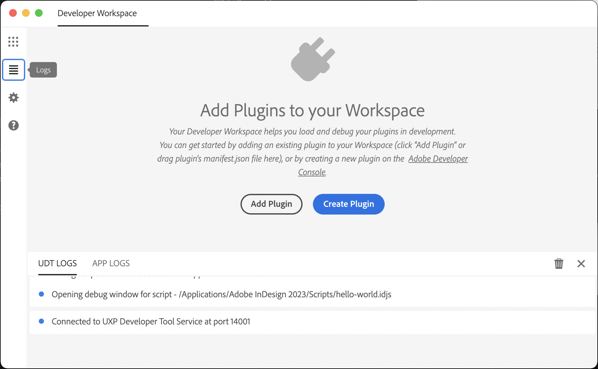

# Adobe UXP Developer Tool

UDT can help you manage, build and test your plugins more efficiently. 

Assuming that you already have successfully installed UDT and created your first plugin using it, let's deep-dive into other capabilities it offers.

## Side pane
The side pane lets you view some basic settings within UDT.

### Connected apps

The left pane shows UXP-powered applications that are "connected" to the tool. UDT can only load plugins into applications that are up and running. As soon as you start or launch the apps you should be able to see them under 'Connected Applications'.

If for some reason you don't; it means UDT is unable to connect to the app. Make sure you're running a version that supports UXP. 

### Preferences

Update your preferences, should you need to change the Service Port, which UDT uses to communicate with host applications or switch to a different theme.

### Logs

Open the logs panel to view logs from UDT and the host application.

## Read more

<DiscoverBlock slots="link, text"/>

[Plugin management](plugin-management/)

Create or Add new plugins to your workspace

<DiscoverBlock slots="link, text"/>

[Plugin workflows](plugin-workflows/)

Load, debug, watch your plugins into the app.

<DiscoverBlock slots="link, text"/>

[Working with React](working-with-react/)

Advanced workflows when working with React-based plugins.
