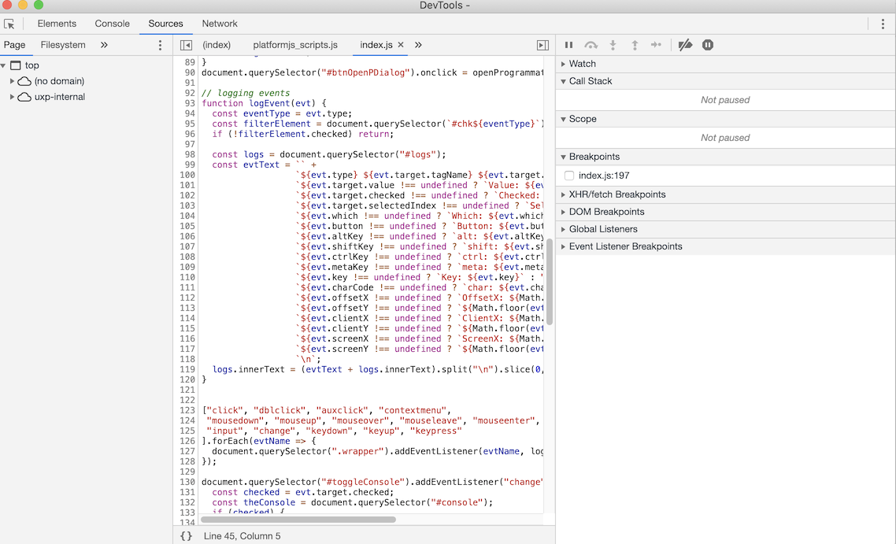

# Plugin workflows

Once you've added a plugin to your developer workspace, there are several things you can do with it. All of the following features are accessed via the **•••**/**Actions** dropdown associated with each plugin.

## Load plugin

Plugins added to the developer workspace do not automatically get added to their supported host application. Instead, once you launch the host application, you should tell the plugin (**••• > Load**) to launch in the host. This allows you to use the marketplace version of your plugin while you're not doing active development, but load up the development version when you need to make a new version of the plugin.

Plugins that load successfully will show a small green notification at the bottom of the screen indicating that the plugin was loaded. 

If a plugin _fails_ to load, a small red notification will appear with a **Details** link.

Clicking the `Details` link in this message will show an error log indicating why the plugin failed to load:

Once your plugin is loaded, you'll typically use the **Reload** action if you need to see any changes in your plugin's behavior. However, if you make changes to your plugin's `manifest.json` file, you'll want to completely **Unload** and **Load** your plugin from scratch.

## Watching and Reloading

Selecting the `Watch` item from the Actions menu causes the Developer Tool to watch for any changes in your code on disk. 
Whenever you make a change to a file in your project, UDT will reload your plugin automatically. This makes for a very rapid code->make mistakes->fix mistakes->reload cycle.

You can also reload your plugin manually by selecting `Reload` from the Actions menu. If you have `Watch` enabled, you shouldn't have to do this. But some people are superstitious.

However, for manifest changes, this action does _not_ refresh the changes. For that, you should **Unload** and **Load** the plugin again.

## Debug your plugin

You can also debug your plugin by choosing `Debug` from the Actions menu. This brings up a window like this:

In this debugger (which resembles the Chrome Developer tool) you can look at the console log, and do the usual debugger things such as setting breakpoints, stepping into and out of functions, walking through code, inspecting elements, and more.

You may also instruct to "break on start" when debugging your plugins. The plugin will immediately break into the debugger when it is loaded so that you can trace through the plugin's initialization routines. Select `More` from the Actions menu and check on 'Break on start'.

Once you're done with debugging, you can close the debugger window.

## Package your plugins for distribution

Once you've got a plugin that's ready for sharing, after it's been thoroughly polished and debugged, you'll need to package it as a "ccx" file. 
- First, make sure you get a plugin ID from the [Developer Distribution portal](https://developer.adobe.com/developer-distribution/creative-cloud/docs/guides/plugin_id/) website before packaging your plugin for distribution.
- Create a ccx file by choosing the `Package` option in the Actions menu.
- Select a folder to store the ccx file. Note that the plugin package will always be named after the plugin's ID.

To find more details about distributing your plugin, see [Sharing Your Plugin](../../../introduction/next-steps/distribution/).
    

---

The **Advanced** section allows you to specify the plugin's build folder, relative to its `manifest.json` file. This is particularly useful when [working with React](./working-with-react/) or other bundlers.

