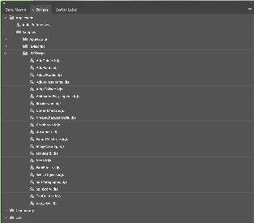
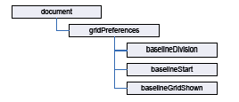
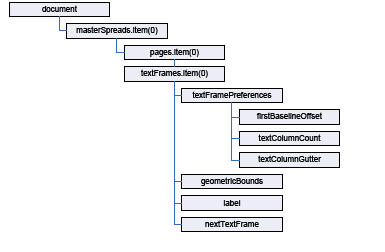
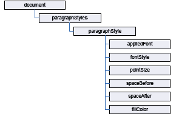

# InDesign Code Recipes

This page outlines various methods available with InDesign Scripting. 

## Alert
Alert can be achieved by having the below method in script. This is using scripting DOM of InDesign to generate the dialog box.

### Usage
---
```js
function alert(msg) {
    theDialog = app.dialogs.add();
    col = theDialog.dialogColumns.add();
    colText = col.staticTexts.add();
    colText.staticLabel = "" + msg;
    theDialog.canCancel = false;
    theDialog.show();
    theDialog.destroy();
    return;
}
```

Note: JavaScript alert isn't supported.

## Math operators
Operators use variables or values to perform calculations (addition, subtraction, multiplication, and division) and return a value. For example:
MyWidth/2

This returns a value equal to half of the content of the variable myWidth.

You also can use operators to perform comparisons: equal to `==`, not equal to `<>`, greater than `>`, or less than `<`. 

For example: `MyWidth > myHeight`

This returns true (or 1) if myWidth is greater than myHeight; otherwise, false (0).

## Conditional statements
Conditional statements make a decision based on an evaluation. For example, "If the selected object is a rectangle, set its stroke weight to 12 points" is a conditional statement. Conditional statements make decisions; they give your scripts a way to evaluate something (like the color of the selected object, the number of pages in the publication, or the date) and act based on the result. Conditional statements almost always start with if.

Note: Conditional statements often make logical comparisons. In UXP Script, the equal sign assigns a value to a variable; to compare objects, use a double equal sign `==`.

This simple example uses a conditional statement to evaluate whether any documents are open. If one or more documents are open  the code that is pasted instead of the comment is executed. If no documents are open, a message window opens. It can be a useful way to check if the script is being used in the context that it should be.

```js
if (app.documents.length > 0) {
//Your code goes here.
}else{
alert ("No documents are open. Please open a document and try again.");
}
```

## Control structures
If you could talk to InDesign, you might say, "Repeat the following procedure 20 times." In scripting terms, this is a control structure. Control structures provide repetitive processes or loops. The idea of a loop is to repeat an action repeatedly with or without changes between instances (or iterations) of the loop, until a specific condition is met. Control structures usually start with for in UXPScript.

Note: Code examples for control structures. Loops a procedure 20 times.

```js
for (var myCounter = 0; myCounter < 20; myCounter++) {
//Your procedure goes here
}
```

## Functions and handlers
Functions are scripting modules to which you can refer from within your script. Typically, you send a value or series of values to a function (or handler) and get back some other value or values. The code used in functions and handlers is simply a convenience to avoid typing the same lines of code repeatedly in your script.

In UXP Script, functions start with **function**.

Using parameters and/or return values is entirely optional. To use the code below, assign a value to myReturnValue, substitute the comment with a procedure and call the function.

If you don't want your function to return anything, remove the line with myReturnValue variable.

```js
function myFunction(myParameter){
//Your procedure goes here
return myReturnValue; (optional)
}
```

## Measurements and positioning
All items and objects in InDesign are positioned on the page according to the measurements you choose. It's helpful to know how the InDesign coordinate system works and what measurement units it uses.

### Coordinates
InDesign, like every other page layout and drawing program, uses simple, two-dimensional geometry to set the position of objects on a page or spread. The horizontal component of a coordinate pair is referred to as x; the vertical component as y. You can see these coordinates in the Transform panel or Control when you select an object using the Selection tool. As in the InDesign user interface, coordinates are measured relative to the current location of the ruler's zero point.

There is one difference between the coordinates used in InDesign and the coordinate system used in a Geometry textbook: on InDesign's vertical (or y) axis, coordinates below the zero point are positive numbers; coordinates above the zero point are negative numbers.

Note: When you ask InDesign for the location of a path point, the coordinates are returned in x and y order. When you set the location of a path point, InDesign expects you to provide the coordinates in the same order. InDesign returns some coordinates in a different order, but it expects you to supply them in that order. Geometric bounds and visible bounds are arrays containing four coordinates, which define (in order) the top, left, bottom, and right edges of the object's bounding box (or y1, x1, y2,x2).

### Working with measurement units
When you send measurement values to InDesign, you can send numbers (for example, 14.65) or measurement strings (for example, "1p7.1"). If you send numbers, InDesign uses the publication's current units of measurement. If you send measurement strings (see the table below), InDesign uses the units of measurement specified in the string.

InDesign returns coordinates and other measurement values using the publication's current measurement units. In some cases, these units don't resemble the measurement values shown in the InDesign Transform panel. For example, if the current measurement system is picas, InDesign returns fractional values as decimals rather than using the picas-and-points notation used by the Transform panel. "1p6," for example, is returned as "1.5." InDesign does this because your scripting system would have trouble trying to perform arithmetic operations using measurement strings; for instance, trying to add "0p3.5" to "13p4" produces a script error while adding .2916 to 13.333 (the converted pica measurements) does not.

If your script depends on adding, subtracting, multiplying, or dividing specific measurement values, you might want to set the corresponding measurement units at the beginning of the script. At the end of the script, you can set the measurement units back to whatever they were before you ran the script. Alternately, you can use measurement overrides, like many of the sample scripts. A measurement override is a string containing a special character, as shown in the following table:

| Override  | Meaning                                        | Example |
|-----------|------------------------------------------------|---------|
| Override  | Meaning                                        | Example |
| c         | Ciceros (add didots after the c, if necessary) | 1.4c    |
| cm        | Centimeters                                    | .635cm  |
| i (or in) | Inches                                         | .25i    |
| mm        | Millimeters                                    | 6.35mm  |
| p         | Picas (add points after the p, if necessary)   | 1p6     |
| pt        | Points                                         | 18pt    |


## Packaged Sample Scripts 
Sample UXP Scripts are packaged along with InDesign and can be found under the Scripts Panel.



## Setting up measurement units and master spread margins
The following script shows how to create a new document and set the margins of the first master spread. In this section, we show how to build a complex script using simple building blocks of scripting code. Start your script editor and enter the following lines in the scripting language of your choice.

Enter the following code in the text editor, or open the DocumentConstruction.idjs tutorial script:

```js
//Create a new document.
var myDocument = app.documents.add();
 
//Set the measurement units and ruler origin.
myDocument.viewPreferences.horizontalMeasurementUnits = MeasurementUnits.points;
myDocument.viewPreferences.verticalMeasurementUnits = MeasurementUnits.points;
myDocument.viewPreferences.rulerOrigin = RulerOrigin.pageOrigin;
 
//Get a reference to the first master spread.
var myMasterSpread = myDocument.masterSpreads.item(0);
 
//Get a reference to the margin preferences of the first page in the master spread.
var myMarginPreferences = myMasterSpread.pages.item(0).marginPreferences;
 
//Now set up the page margins and columns.
myMarginPreferences.left = 84;
myMarginPreferences.top = 70;
myMarginPreferences.right = 70;
myMarginPreferences.bottom = 78;
myMarginPreferences.columnCount = 3;
myMarginPreferences.columnGutter = 14;
 
//Page margins and columns for the right-hand page.
var myMarginPreferences = myMasterSpread.pages.item(1).marginPreferences;
myMarginPreferences.left = 84;
myMarginPreferences.top = 70;
myMarginPreferences.right = 70;
myMarginPreferences.bottom = 78;
myMarginPreferences.columnCount = 3;
myMarginPreferences.columnGutter = 14;
```

## Adding a baseline grid
Now that we have a master spread set up, we add a baseline grid. Add the following script lines (from the appropriate language) to the end of the script you created earlier. Here is a diagram (with the scripting terms shown in their JavaScript form):



```js
var myGridPreferences = myDocument.gridPreferences;
myGridPreferences.baselineDivision = 14;
myGridPreferences.baselineStart = 70;
myGridPreferences.baselineGridShown = true;
```

## Adding master page items
Next, we add two text frames to the master pages. These frames will contain the auto-page-number special character and be positioned at the bottom of the page.

In the "Hello World" example, we created a text frame and specified its position and size using the geometric bounds property-an array containing the top, left, bottom, and right coordinates for the frame. The coordinates correspond to the corners of the frame, just as they would appear in the Control panel.

```js
var myMasterSpread = myDocument.masterSpreads.item(0);
var myLeftPage = myMasterSpread.pages.item(0);
var myRightPage = myMasterSpread.pages.item(1);
var myLeftFooter = myLeftPage.textFrames.add();
myLeftFooter.geometricBounds = [63, 3, 66, 9];
myLeftFooter.textFramePreferences.firstBaselineOffset = FirstBaseline.leadingOffset;
myLeftFooter.contents = SpecialCharacters.autoPageNumber;
myLeftFooter.parentStory.characters.item(0).pointSize = 11;
myLeftFooter.parentStory.characters.item(0).leading = 14;
var myRightFooter = myRightPage.textFrames.add();
myRightFooter.geometricBounds = [63, 92, 66, 99];
myRightFooter.textFramePreferences.firstBaselineOffset = FirstBaseline.leadingOffset;
myRightFooter.contents = SpecialCharacters.autoPageNumber;
myRightFooter.parentStory.characters.item(0).pointSize = 11;
myRightFooter.parentStory.characters.item(0).leading = 14;
myRightFooter.parentStory.characters.item(0).justification = Justification.rightAlign;
```

## Adding master text frames
Next, we add master text frames. The following block diagram shows the objects and properties with which we will work (the diagram uses the JavaScript form of the scripting terms):



```js
var myLeftPage = myMasterSpread.pages.item(0);
var myRightPage = myMasterSpread.pages.item(1);
var myLeftTextFrame = myLeftPage.textFrames.add();
myLeftTextFrame.geometricBounds = [3, 3, 25, 43];
myLeftTextFrame.textFramePreferences.firstBaselineOffset = FirstBaseline.leadingOffset;
myLeftTextFrame.textFramePreferences.textColumnCount = 3;
myLeftTextFrame.textFramePreferences.textColumnGutter = 14;
//Add a label to make the frame easier to find later on.
myLeftTextFrame.label = "BodyTextFrame";
var myRightTextFrame = myRightPage.textFrames.add();
myRightTextFrame.geometricBounds = [3, 54, 25, 91];
myRightTextFrame.textFramePreferences.firstBaselineOffset = FirstBaseline.leadingOffset;
myRightTextFrame.textFramePreferences.textColumnCount = 3;
myRightTextFrame.textFramePreferences.textColumnGutter = 14;
//Add a label to make the frame easier to find later on.
myRightTextFrame.label = "BodyTextFrame";
//Link the two frames using the nextTextFrame property.
myLeftTextFrame.nextTextFrame = myRightTextFrame;
```

## Overriding master page items and adding text
Next, we override one of the master text frames we created and add text to it. Again, add this script to the end of the script we have been working on.

```js
var myTextFrame = myDocument.masterSpreads.item(0).pages.item(1).textFrames.item(0).override(myDocument.pages.item(0));
//Add text by setting the contents of an insertion point to a string.
//In JavaScript, "\r" is a return character.
myTextFrame.insertionPoints.item(0).contents = "Headline!\r";
```

## Adding and applying a paragraph style
Our headline looks plain, so we format it using a paragraph style. First, we must create the paragraph style. The following diagram shows the objects and properties we will work with (again, the text in this diagram uses the JavaScript form of the scripting terms):



```js
//First, check to see if the paragraph style already exists.
var myParagraphStyle = myDocument.paragraphStyles.item("Heading 1");
try {
    var myName = myParagraphStyle.name;
}
catch (myError){
    //The paragraph style did not exist, so create it.
    myParagraphStyle = myDocument.paragraphStyles.add({name:"Heading 1"});
}
//We'll need to create a color. Check to see if the color already exists.
var myColor = myDocument.colors.item("Red");
try {
    myName = myColor.name;
}
catch (myError){
    //The color did not exist, so create it.
    myColor = myDocument.colors.add({name:"Red", model:ColorModel.process,
    colorValue:[0,100,100,0]});
}
//Now set the formatting of the paragraph style.
myParagraphStyle.appliedFont = "Arial";
myParagraphStyle.fontStyle = "Bold";
myParagraphStyle.pointSize = 24;
myParagraphStyle.spaceAfter = 24;
myParagraphStyle.spaceBefore = 24;
myParagraphStyle.fillColor = myDocument.colors.item("Red");
//Apply the style to the paragraph.
myDocument.pages.item(0).textFrames.item(0).paragraphs.item(0).applyParagraphStyle(
myParagraphStyle, true);
//You could also use:
//myDocument.pages.item(0).textFrames.item(0).paragraphs.item(0).appliedParagraphStyle = myParagraphStyle;
```

## Placing a text file
Next, we import a text file. We add the text after the headline in the first text frame on the first page. The script displays a dialog box you can use to select the text file you want to import. Again, add this script to the end of the script we have been working on.

```js
//Display a standard open file dialog box to select a text file.
var myTextFile = <File Path of txt file>
 //Example : var myTextFile = "C://IDS/myText.txt";
 //If a text file was selected, and if you didn't press Cancel,
//place the text file at the first insertion point after the headline.
if((myTextFile != "")&&(myTextFile != null)){
    myTextFrame.insertionPoints.item(-1).place(myTextFile);
}
```

## Place a graphic
Placing a graphic is like importing a text file. Again, the script displays a dialog box you can use to select the graphic you want to place. When we place the graphic, InDesign Server returns a reference to the graphic itself, rather than to the frame containing the graphic. To get a reference to the frame, use the parent property of the graphic. Once we have that reference, we can apply an object style to the frame. Again, add this script to the end of the script we have been working on.

```js
//Display a standard open file dialog box to select a graphic file.
 var myGraphicFile = <File Path of graphic file>
//Example : var myGraphicFile = "C://IDS/myImage.PNG";
 //If a graphic file was selected, and if you didn't press Cancel,
//place the graphic file on the page.
if((myGraphicFile != "")&&(myGraphicFile != null)){
    var myGraphic = myDocument.pages.item(0).place(myGraphicFile);
    //Since you can place multiple graphics at once, the place method
    //returns an array. To get the graphic you placed, get the first
    //item in the array (JavaScript arrays start with item 0).
    myGraphic = myGraphic[0];
    //Create an object style to apply to the graphic frame.
    var myObjectStyle = myDocument.objectStyles.item("GraphicFrame");
    try {
        var myName = myObjectStyle.name;
    }
    catch (myError){
        //The object style did not exist, so create it.
        myObjectStyle = myDocument.objectStyles.add({name:"GraphicFrame"});
    }
    myObjectStyle.enableStroke = true;
    myObjectStyle.strokeWeight = 3;
    myObjectStyle.strokeType = myDocument.strokeStyles.item("Solid");
    myObjectStyle.strokeColor = myDocument.colors.item("Red");
    //The frame containing the graphic is the parent of the graphic.
    var myFrame = myGraphic.parent;
    myFrame.applyObjectStyle(myObjectStyle, true);
    //Resize the frame to a specific size.
    myFrame.geometricBounds = [0,0,144,144];
    //Fit the graphic to the frame proportionally.
    myFrame.fit(FitOptions.proportionally);
    //Next, fit frame to the resized graphic.
    myFrame.fit(FitOptions.frameToContent);
    var myBounds = myFrame.geometricBounds;
    var myGraphicWidth = myBounds[3]-myBounds[1];
    //Move the graphic frame.
    var myPageWidth = myDocument.documentPreferences.pageWidth;
    var myTopMargin = myDocument.pages.item(0).marginPreferences.top;
    myFrame.move([myPageWidth-myGraphicWidth, myTopMargin]);
    //Apply a text wrap to the graphic frame.
    myFrame.textWrapPreferences.textWrapMode = TextWrapModes.BOUNDING_BOX_TEXT_WRAP;
    myFrame.textWrapPreferences.textWrapOffset = [24, 12, 24, 12];
}
```

## XML

### Importing XML

Once you set the XML import preferences the way you want them, you can import an XML file, as shown in the following script fragment (from the ImportXML tutorial script):

```js

let ufs = require("uxp").storage.localFileSystem;
let myDocument = app.documents.item(0);
//You'll have to fill in a valid file path for your system.
let folder =  await ufs.getEntryWithUrl("file:c:/Users/uxp/Desktop");
let filePath;
try {
    filePath = await folder.getEntry("sampleXML.xml");
}
catch (error){
    filePath = await folder.createEntry("sampleXML.xml");
}
myDocument = app.documents.item(0);
myDocument.xmlElements.item(0).importXML(filePath);
```

When you need to import the contents of an XML file into a specific XML element, use the importXML method of the XML element, rather than the corresponding method of the document. See the following script fragment (from the ImportXMLIntoElement tutorial script):

```js
let ufs = require("uxp").storage.localFileSystem;
let myDocument = app.documents.item(0);
//You'll have to fill in a valid file path for your system.
let folder =  await ufs.getEntryWithUrl("file:c:/Users/uxp/Desktop");
let filePath;
try {
    filePath = await folder.getEntry("sampleXML.xml");
}
catch (error){
    filePath = await folder.createEntry("sampleXML.xml");
}
myDocument = app.documents.item(0);
let myPage = app.activeWindow.activePage;
myDocument.importXML(filePath);
let myRootXMLElement = myDocument.xmlElements.item(0);
let myLastXMLElement = myRootXMLElement.xmlElements.item(-1);
//Select the XML element
myDocument.select(myLastXMLElement, SelectionOptions.replaceWith);
myDocument.xmlImportPreferences.importToSelected = true;
myDocument.importXML(filePath);
```

You also can set the importToSelected property of the xmlImportPreferences object to true, then select the XML element, and then import the XML file, as shown in the following script fragment (from the ImportXMLIntoSelectedElement tutorial script):

```js
let myDocument = app.documents.item(0);
let myXMLTag = myDocument.xmlTags.item("xml_element");
let myXMLElement = myDocument.xmlElements.item(0).xmlElements.add(myXMLTag);
myDocument.select(myXMLElement);
myDocument.xmlImportPreferences.importToSelected = true;
//Import into the selected XML element.
myDocument.importXML(filePath);
```

### Loading XML tags

You can import XML tags from an XML file without importing the XML contents of the file. You might want to do this to work out a tag-to-style or style-to-tag mapping before you import the XML data., as shown in the following script fragment (from the LoadXMLTags tutorial script):

```js
let ufs = require("uxp").storage.localFileSystem;
let myDocument = app.documents.item(0);
//You'll have to fill in a valid file path for your system.
let folder =  await ufs.getEntryWithUrl("file:c:/Users/uxp/Desktop");
let filePath;
try {    
filePath = await folder.getEntry("sampleXML.indd");
} catch (error){    
filePath = await folder.createEntry("sampleXML.indd");
}
myDocument.loadXMLTags (filePath);
```

### Saving XML tags

Just as you can load XML tags from a file, you can save XML tags to a file, as shown in the following script. When you do this, only the tags themselves are saved in the XML file; document data is not included. As you would expect, this process is much faster than exporting XML, and the resulting file is much smaller. The following sample script shows how to save XML tags (for the complete script, see SaveXMLTags):

```js
//You'll have to fill in a valid file path for your system.
myDocument.saveXMLTags(filePath);
```

## XML Rules

### Setting up a sample document

```js
let ufs = require("uxp").storage.localFileSystem;
let myDocument = app.documents.item(0);
let folder =  await ufs.getEntryWithUrl("file:c:/Users/uxp/Desktop");
let filePath;
try {
    filePath = await folder.getEntry("sampleXML.xml");
}
catch (error){
    filePath = await folder.createEntry("sampleXML.xml");
}
 
main();
function main(){
    let myDocument = app.documents.add();
    myDocument.xmlImportPreferences.allowTransform = false;
    myDocument.xmlImportPreferences.ignoreWhitespace = true;
    myDocument.importXML(filePath);
    let myBounds = myGetBounds(myDocument, myDocument.pages.item(0));
    myDocument.xmlElements.item(0).placeIntoFrame(myDocument.pages.item(0), myBounds);
    function myGetBounds(myDocument, myPage){
        let myWidth = myDocument.documentPreferences.pageWidth;
        let myHeight = myDocument.documentPreferences.pageHeight;
        let myX1 = myPage.marginPreferences.left;
        let myY1 = myPage.marginPreferences.top;
        let myX2 = myWidth - myPage.marginPreferences.right;
        let myY2 = myHeight - myPage.marginPreferences.bottom;
        return [myY1, myX1, myY2, myX2];
    }
    function myGetScriptPath() {
        try {
            return app.activeScript;
        }
        catch(myError){
            console.log(myError);
        }
    }
}
```
