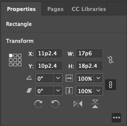

# Measurements and positioning

All items and objects in InDesign are positioned on the page according to the measurements you choose. It's helpful to know how the InDesign coordinate system works and what measurement units it uses.

### Coordinates
InDesign, like every other page layout and drawing program, uses simple, two-dimensional geometry to set the position of objects on a page or spread. The horizontal component of a coordinate pair is referred to as x; the vertical component as y. You can see these coordinates in the Transform panel or Control when you select an object using the Selection tool.

<InlineAlert variant="info" slots="text1, text2"/>

Note that, 
- The coordinates are measured relative to the **current** location of the ruler's zero point.
- In the vertical (or y) axis, coordinates below the zero point are positive numbers; coordinates above the zero point are negative numbers.
- The coordinates for the location of a path point are returned in x and y order. You should set the coordinates of the path point, in the same order. 
- The coordinates of a bounding box of an object are represented in an array containing four coordinates. It is defined (in order) the top, left, bottom, and right edges of the bounding box (or y1, x1, y2,x2). 

### Working with measurement units

InDesign returns coordinates and other measurement values using the publication's current measurement units. However, in some cases, these units don't resemble the measurement values shown in the InDesign Transform panel. For example, if the current measurement system is picas, InDesign returns fractional values as decimals rather than using the picas-and-points notation used by the Transform panel. "1p6," for example, is returned as "1.5." InDesign does this because your scripts/plugins would have trouble trying to perform arithmetic operations using measurement strings; for instance, trying to add "0p3.5" to "13p4" produces an error while adding .2916 to 13.333 (the converted pica measurements) does not.

If you are adding, subtracting, multiplying, or dividing specific measurement values, it is recommended to first set the corresponding measurement units, before the operation. In the end, you can set the measurement units back to whatever they were before. 

You can set measurement values using numbers (for example, 14.65) or strings (for example, "1p7.1"). If you use numbers, InDesign uses the publication's current units of measurement. If you send measurement strings (see the table below), InDesign uses the units of measurement specified in the string.

Alternatively, you can use measurement overrides, like many of the sample scripts. A measurement override is a string containing a special character, as shown in the following table:

<!-- TODO Give an example or point to API docs that let dev set/get/override measurement units -->

| Override  | Meaning                                        | Example |
|-----------|------------------------------------------------|---------|
| c         | Ciceros (add didots after the c, if necessary) | 1.4c    |
| cm        | Centimeters                                    | .635cm  |
| i (or in) | Inches                                         | .25i    |
| mm        | Millimeters                                    | 6.35mm  |
| p         | Picas (add points after the p, if necessary)   | 1p6     |
| pt        | Points                                         | 18pt    |
