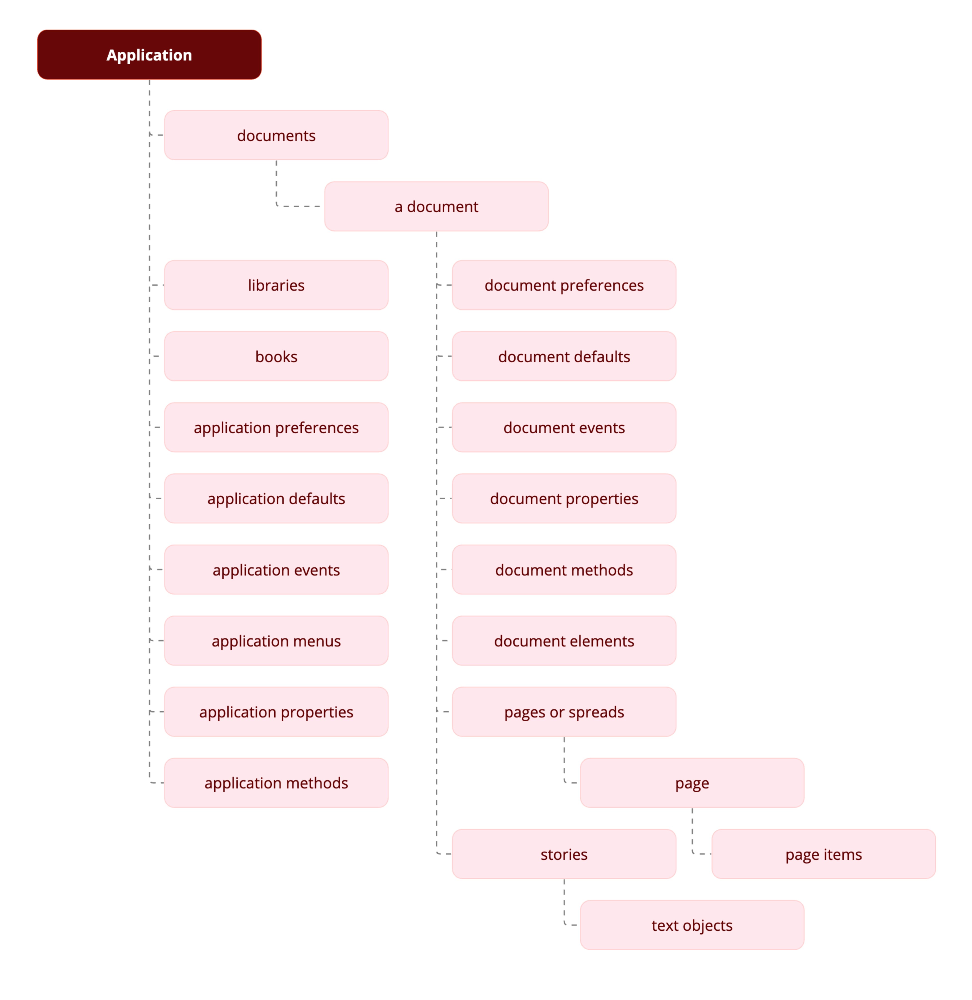

# Object model

Understanding the object model is the key to finding the object you want to work with.

The following figure is an overview of the InDesign object model. Objects in your publication are arranged in a specific order: frames are on pages, which are inside a document, which is inside the InDesign application object. This hierarchy of objects is referred to as the object model and these objects together make up an InDesign publication.

**NOTE** that the diagram isn't a comprehensive list of the objects available to InDesign; instead, it's a conceptual framework for understanding the relationships between the types of objects and the overall structure of how they are organized.

The objects in the diagram are described briedfly in the following section:
## Application

| Term    | What it represents       |
| ------------------------- | ---------------------------------------------------------------- |
| Application _defaults_    | Application default settings, such as colors, paragraph styles, and object styles. Application defaults affect all new documents. |
| Application _methods_     | JavaScript(Objects also haveExtend Script)The application can take actions such as finding and changing text, copying the selection, creating new documents, and opening libraries. |
| Application _preferences_ | For example, text preferences, PDF export preferences, and document preferences. Many of the preferences objects also exist at the document level. Just as in the user interface, application preferences are applied to new documents. Document preferences change the settings of a specific document. |
| Application _properties_  | The properties of the application, for example, the full path to the application, the locale of the application, and the user name. |

## Books
A collection of open books.

## Libraries
A collection of open libraries. 

## Document
An InDesign document

| Term    | What it represents       |
| ------------------------- | ---------------------------------------------------------------- |
| Document defaults       | Document default settings, such as colors, paragraph styles, and text formatting defaults.  |
| Document elements       | For example, the stories, imported graphics, and pages of a document. The figure that precedes this table shows pages and stories because those objects are essential containers for other objects, but document elements also include rectangles, ovals, groups, XML elements, and any other type of object you can import or create. |
| Document methods        | Sample Scripts with UXP APIsThe documents can take actions such as closing a document, printing a document, and exporting a document. |
| Document preferences    | The preferences of a document, such as guide preferences, view preferences, and document preferences. |
| Document properties     | For example, the document filename, number of pages, and zero point location. |
| Documents               | A collection of open documents.   |

### Pages or spreads 
The pages or spreads in an InDesign document.

| Term    | What it represents       |
| ------------------------- | ---------------------------------------------------------------- |
| Page        | A single page within the document.                              |
| Page _items_              | Any object you can create or place on a page. There are many types of page items, such as text frames, rectangles, graphic lines, or groups.  |

### Stories
The text in an InDesign document.

| Term    | What it represents       |
| ------------------------- | ---------------------------------------------------------------- |
| Text objects            | Characters, words, lines, paragraphs, and text columns are examples of text objects in an InDesign story. |
