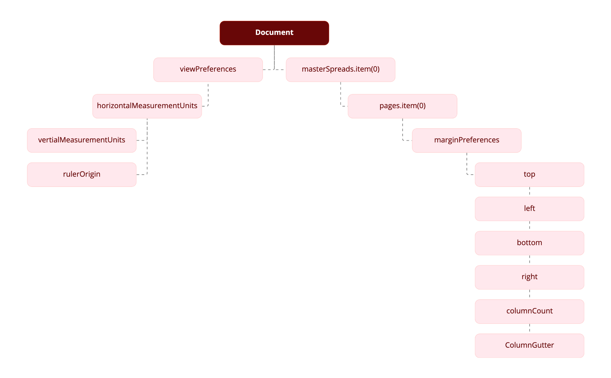
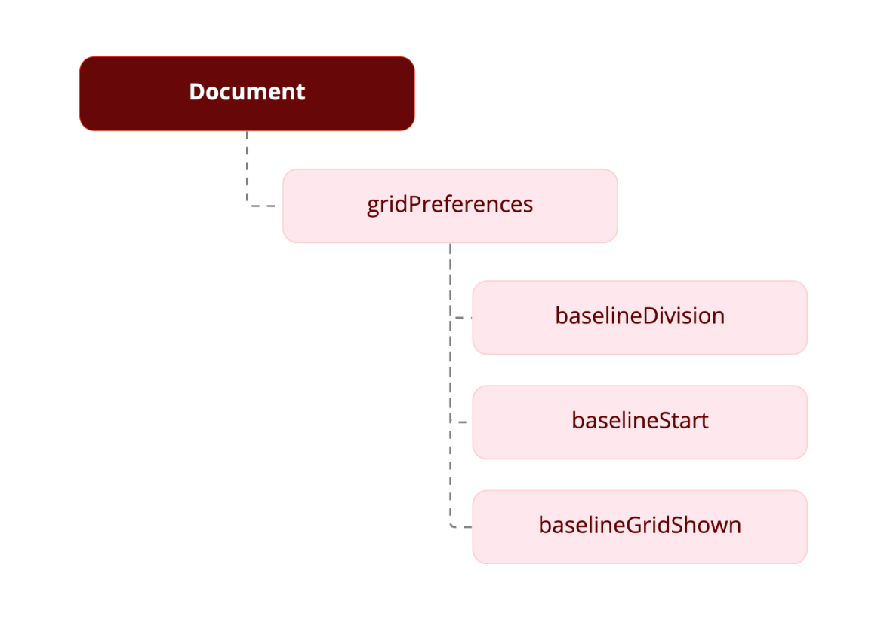
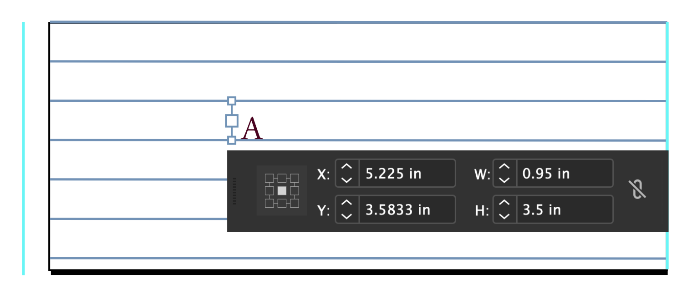
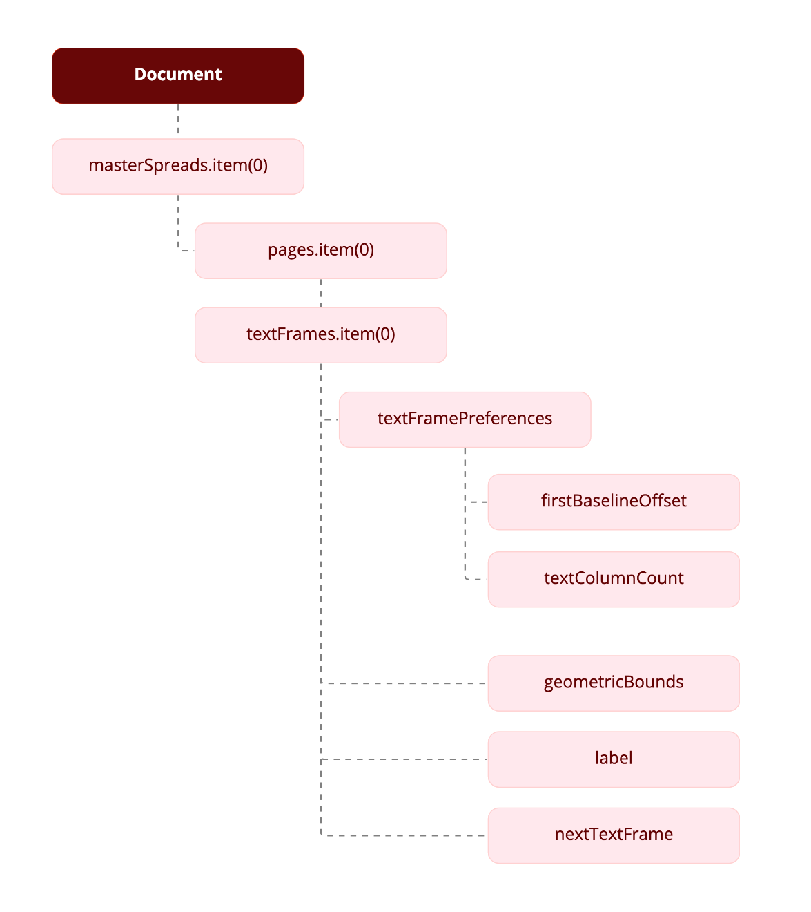
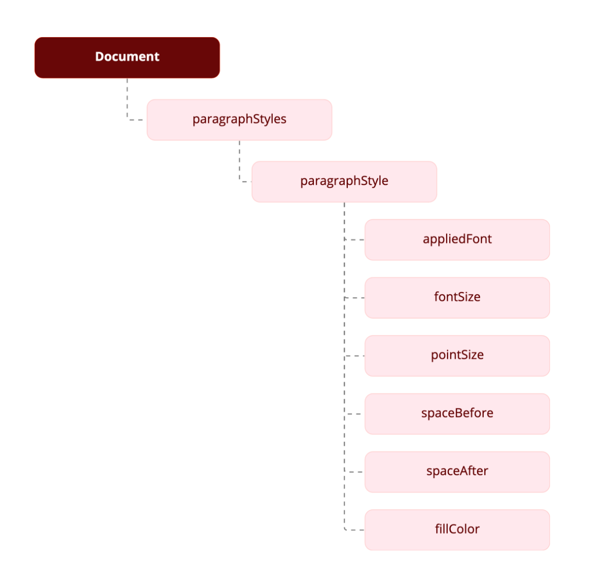

# Document changes
Let's add some details to the InDesign document


We'll create a new document, set page margins, and define and apply master pages. The following figure shows a block diagram that represents the objects we'll work with.



The objects in the object model generally correspond to the names of controls in the user interface, as shown in the following diagram: 


```js
const { app } = require("indesign").app;
let myDocument = app.documents.add();
```

## Setting up measurement units and master spread margins
The following script fragment shows how to create a new document and set the margins of the first master spread.

```js 
//Set the measurement units and ruler origin.
myDocument.viewPreferences.horizontalMeasurementUnits = MeasurementUnits.points;
myDocument.viewPreferences.verticalMeasurementUnits = MeasurementUnits.points;
myDocument.viewPreferences.rulerOrigin = RulerOrigin.pageOrigin;
 
//Get a reference to the first master spread.
var myMasterSpread = myDocument.masterSpreads.item(0);
 
//Get a reference to the margin preferences of the first page in the master spread.
var myMarginPreferences = myMasterSpread.pages.item(0).marginPreferences;
 
//Now set up the page margins and columns.
myMarginPreferences.left = 84;
myMarginPreferences.top = 70;
myMarginPreferences.right = 70;
myMarginPreferences.bottom = 78;
myMarginPreferences.columnCount = 3;
myMarginPreferences.columnGutter = 14;
 
//Page margins and columns for the right-hand page.
var myMarginPreferences = myMasterSpread.pages.item(1).marginPreferences;
myMarginPreferences.left = 84;
myMarginPreferences.top = 70;
myMarginPreferences.right = 70;
myMarginPreferences.bottom = 78;
myMarginPreferences.columnCount = 3;
myMarginPreferences.columnGutter = 14;
```

## Adding a baseline grid
Now that we have a master spread set up, we will add a baseline grid. Here is a block diagram that shows the relationship between the objects we'll be working with:



```js
var myGridPreferences = myDocument.gridPreferences;
myGridPreferences.baselineDivision = 14;
myGridPreferences.baselineStart = 70;
myGridPreferences.baselineGridShown = true;
```

## Adding master page items
Next, we add two text frames to the master pages. These frames will contain the auto-page-number special character and be positioned at the bottom of the page.

In the "Hello World" example, we created a text frame and specified its position and size using the geometric bounds property-an array containing the top, left, bottom, and right coordinates for the frame. The coordinates correspond to the corners of the frame, just as they would appear in the Control panel. The geometric bounds are: top = 728, left = 70, bottom = 742, and right = 528, as shown in the following two figures:



```js
var myMasterSpread = myDocument.masterSpreads.item(0);
var myLeftPage = myMasterSpread.pages.item(0);
var myRightPage = myMasterSpread.pages.item(1);
var myLeftFooter = myLeftPage.textFrames.add();
myLeftFooter.geometricBounds = [63, 3, 66, 9];
myLeftFooter.textFramePreferences.firstBaselineOffset = FirstBaseline.leadingOffset;
myLeftFooter.contents = SpecialCharacters.autoPageNumber;
myLeftFooter.parentStory.characters.item(0).pointSize = 11;
myLeftFooter.parentStory.characters.item(0).leading = 14;
var myRightFooter = myRightPage.textFrames.add();
myRightFooter.geometricBounds = [63, 92, 66, 99];
myRightFooter.textFramePreferences.firstBaselineOffset = FirstBaseline.leadingOffset;
myRightFooter.contents = SpecialCharacters.autoPageNumber;
myRightFooter.parentStory.characters.item(0).pointSize = 11;
myRightFooter.parentStory.characters.item(0).leading = 14;
myRightFooter.parentStory.characters.item(0).justification = Justification.rightAlign;
```

## Adding master text frames
Next, we add master text frames. The following block diagram shows the objects and properties we'll be working with:



```js
var myLeftPage = myMasterSpread.pages.item(0);
var myRightPage = myMasterSpread.pages.item(1);
var myLeftTextFrame = myLeftPage.textFrames.add();
myLeftTextFrame.geometricBounds = [3, 3, 25, 43];
myLeftTextFrame.textFramePreferences.firstBaselineOffset = FirstBaseline.leadingOffset;
myLeftTextFrame.textFramePreferences.textColumnCount = 3;
myLeftTextFrame.textFramePreferences.textColumnGutter = 14;
//Add a label to make the frame easier to find later on.
myLeftTextFrame.label = "BodyTextFrame";
var myRightTextFrame = myRightPage.textFrames.add();
myRightTextFrame.geometricBounds = [3, 54, 25, 91];
myRightTextFrame.textFramePreferences.firstBaselineOffset = FirstBaseline.leadingOffset;
myRightTextFrame.textFramePreferences.textColumnCount = 3;
myRightTextFrame.textFramePreferences.textColumnGutter = 14;
//Add a label to make the frame easier to find later on.
myRightTextFrame.label = "BodyTextFrame";
//Link the two frames using the nextTextFrame property.
myLeftTextFrame.nextTextFrame = myRightTextFrame;
```

## Overriding master page items and adding text
Next, we override one of the master text frames we created and add text.

```js
var myTextFrame = myDocument.masterSpreads.item(0).pages.item(1).textFrames.item(0).override(myDocument.pages.item(0));
//Add text by setting the contents of an insertion point to a string.
//In JavaScript, "\r" is a return character.
myTextFrame.insertionPoints.item(0).contents = "Headline!\r";
```

## Adding and applying a paragraph style
Our headline looks plain, so we will format it in a paragraph style. To do that, we must create the paragraph style. The following diagram shows the objects and properties we will work with:



```js
//First, check to see if the paragraph style already exists.
var myParagraphStyle = myDocument.paragraphStyles.item("Heading 1");
try {
    var myName = myParagraphStyle.name;
}
catch (myError){
    //The paragraph style did not exist, so create it.
    myParagraphStyle = myDocument.paragraphStyles.add({name:"Heading 1"});
}
//We'll need to create a color. Check to see if the color already exists.
var myColor = myDocument.colors.item("Red");
try {
    myName = myColor.name;
}
catch (myError){
    //The color did not exist, so create it.
    myColor = myDocument.colors.add({name:"Red", model:ColorModel.process,
    colorValue:[0,100,100,0]});
}
//Now set the formatting of the paragraph style.
myParagraphStyle.appliedFont = "Arial";
myParagraphStyle.fontStyle = "Bold";
myParagraphStyle.pointSize = 24;
myParagraphStyle.spaceAfter = 24;
myParagraphStyle.spaceBefore = 24;
myParagraphStyle.fillColor = myDocument.colors.item("Red");
//Apply the style to the paragraph.
myDocument.pages.item(0).textFrames.item(0).paragraphs.item(0).applyParagraphStyle(
myParagraphStyle, true);
//You could also use:
//myDocument.pages.item(0).textFrames.item(0).paragraphs.item(0).appliedParagraphStyle = myParagraphStyle;
```

## Placing a text file
Next, we import a text file. We add the text after the headline in the first text frame on the first page. The script displays a dialog box that you can use to select the text file to import.

```js
//Display a standard open file dialog box to select a text file.
var myTextFile = <File Path of txt file>
 //Example : var myTextFile = "C://IDS/myText.txt";
 //If a text file was selected, and if you didn't press Cancel,
//place the text file at the first insertion point after the headline.
if((myTextFile != "")&&(myTextFile != null)){
    myTextFrame.insertionPoints.item(-1).place(myTextFile);
}
```

## Place a graphic
Placing a graphic is like importing a text file. Again, the script displays a dialog box that you can use to select the graphic to place. When we place the graphic, InDesign returns a reference to the graphic itself rather than to the frame containing the graphic. To get a reference to the frame, use the parent property of the graphic. Once we have that reference, we can apply an object style to the frame.

```js
//Display a standard open file dialog box to select a graphic file.
 var myGraphicFile = <File Path of graphic file>
//Example : var myGraphicFile = "C://IDS/myImage.PNG";
 //If a graphic file was selected, and if you didn't press Cancel,
//place the graphic file on the page.
if((myGraphicFile != "")&&(myGraphicFile != null)){
    var myGraphic = myDocument.pages.item(0).place(myGraphicFile);
    //Since you can place multiple graphics at once, the place method
    //returns an array. To get the graphic you placed, get the first
    //item in the array (JavaScript arrays start with item 0).
    myGraphic = myGraphic[0];
    //Create an object style to apply to the graphic frame.
    var myObjectStyle = myDocument.objectStyles.item("GraphicFrame");
    try {
        var myName = myObjectStyle.name;
    }
    catch (myError){
        //The object style did not exist, so create it.
        myObjectStyle = myDocument.objectStyles.add({name:"GraphicFrame"});
    }
    myObjectStyle.enableStroke = true;
    myObjectStyle.strokeWeight = 3;
    myObjectStyle.strokeType = myDocument.strokeStyles.item("Solid");
    myObjectStyle.strokeColor = myDocument.colors.item("Red");
    //The frame containing the graphic is the parent of the graphic.
    var myFrame = myGraphic.parent;
    myFrame.applyObjectStyle(myObjectStyle, true);
    //Resize the frame to a specific size.
    myFrame.geometricBounds = [0,0,144,144];
    //Fit the graphic to the frame proportionally.
    myFrame.fit(FitOptions.proportionally);
    //Next, fit frame to the resized graphic.
    myFrame.fit(FitOptions.frameToContent);
    var myBounds = myFrame.geometricBounds;
    var myGraphicWidth = myBounds[3]-myBounds[1];
    //Move the graphic frame.
    var myPageWidth = myDocument.documentPreferences.pageWidth;
    var myTopMargin = myDocument.pages.item(0).marginPreferences.top;
    myFrame.move([myPageWidth-myGraphicWidth, myTopMargin]);
    //Apply a text wrap to the graphic frame.
    myFrame.textWrapPreferences.textWrapMode = TextWrapModes.BOUNDING_BOX_TEXT_WRAP;
    myFrame.textWrapPreferences.textWrapOffset = [24, 12, 24, 12];
}
```

