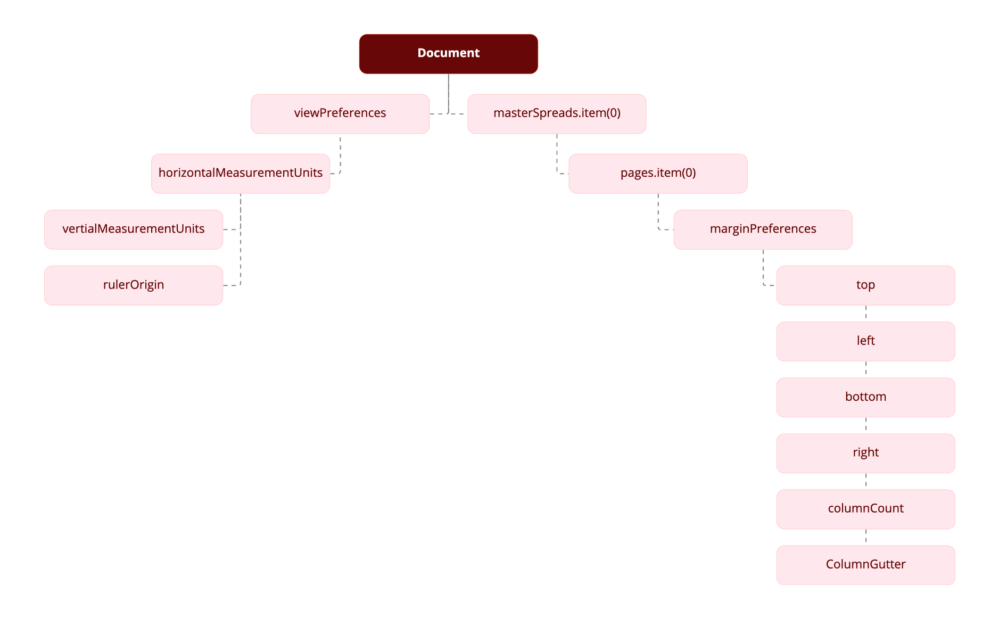

# Getting started guide

Get started and create your first Adobe InDesign Script.

In this guide, we will cover the basics of InDesign scripting, and create a simple InDesign script using UXP that creates a new document, adds a text frame, and enters text in the text frame. 

## UXP Scripting in InDesign

UXP Scripts should be written in JavaScript, and the file should be saved as `<filename>.idjs`. Saving the script as .idjs enables the UXP engine in InDesign and executes the script as UXP script.( .jsx will execute as normal ExtendScript)

## Installing scripts

Installing an InDesign script is easy: add the script file to the scripts folder so that it shows up in the Scripts panel.  inside the Scripts folder in your InDesign application folder (/Applications/Adobe\ InDesign\ 2023\ \(Prerelease-Debug\)/Scripts). (Create the Scripts folder if it does not already exist.) Note: this may require admin access.

Alternately, put the script inside the Scripts Panel folder in your preferences folder. Your preferences folder is at:

Windows: `C:\Users\<username>\AppData\Roaming\Adobe\InDesign\Version 18.0\<locale>\Scripts`
Mac: `/Users/<username>/Library/Preferences/Adobe InDesign/Version 18.0/<locale>/Scripts`
Above, `<username>` is your user name and `<locale>` references your location and language, for example, en_US.

Once the script is in the folder, it appears on the Scripts panel inside InDesign. To display the panel, choose Window > Utilities > Scripts.

You  can also put aliases/shortcuts to scripts (or folders containing scripts) in the Scripts Panel folder, and they will appear in the Scripts panel.

To run a specific script when InDesign starts, put it inside a folder named "Startup Scripts" inside the Scripts folder (create this folder if it does not already exist).

## Running a script

To run a script, display the Scripts panel (choose Window > Utilities > Scripts), then double-click the script name in the Scripts panel. Many scripts display user-interface items (like dialog boxes or panels) and display alerts if necessary.

We can also right-click on the script name and then click on run in drop-down menu.


## Using the scripts panel

The InDesign Scripts panel is the easiest and best way to run most InDesign scripts. If the panel is not already visible, you can display it by choosing Window > Utilities > Scripts.

To edit a script shown in the Scripts panel, select the script and choose Edit Script from the Scripts panel menu. Alternatively, you can hold down the Option (Mac OS) or Alt (Windows) key and double-click the script's name. This opens the script in the editor you defined for the script file type.

To open the folder containing a script shown in the Scripts panel, select the script and choose Reveal in Finder (Mac OS) or Reveal in Explorer (Windows). Alternatively, you can hold down the Command (Mac OS) or Ctrl-Shift (Windows) keys and double-click the script's name. The script folder opens in the Finder (Mac OS) or Explorer (Windows).

## Your first UXP script

Below, we will create our first hello-world UXP InDesign script. 

Our script will creates a new document, adds a text frame, and enters text in the text frame. This demonstrates how to do the following:

* Create a new document.
* Create a text frame on a specific page.
* Add text to a text frame.
* Start a text editor and enter the following script:

```js
//HelloWorld.idjs
//An InDesign UXPScript
//
//Creates a new document, adds a text frame,
//resizes the text frame and adds text.
var myDocument = app.documents.add();
var myTextFrame = myDocument.pages.item(0).textFrames.add();
/*Set the geometric bounds (the location of the top, left, bottom, and right edges) of the text frame. In this step, the script uses measurement overrides ("p" for picas) to ensure the text frame is the correct size, regardless of your default measurement units. The locations are provided as a list, or array, of values; each scripting language has a slightly different way of creating an array. */
 myTextFrame.geometricBounds = ["6p", "6p", "24p", "24p"];
//Add text to the text frame by setting the proporty of the content to a string myTextFrame.contents = "Hello World!";
```

Save the script as a plain-text file with the .idjs file extension to the Scripts Panel folder. To run the script, double-click the script name in the Scripts panel.

Congratulations! You have now created your first InDesign script. Below goes over how to add more features to it.

## Adding features to our Hello World script

In the following guide we will build upon the initial hello-world script we created above.

Our updated script will demonstrates how to do the following:

* Get the active document.
* Use a function (or handler in AppleScript).
* Get the page dimensions and page margins of the active document.
* Resize a text frame.
* Change the formatting of the text in the text frame.

Make sure you have the Hello World document open-this script relies on objects we created in that script. If you closed the document without saving it, simply run the HelloWorld.jsx script again to make a new document.

Either open the ImprovedHelloWorld.jsx tutorial script or perform the following steps to create the script:

1. Enter the following JavaScript in a new text file

```js
//Improved HelloWorld.idjs
//An InDesign UXP Script
//
//Enter the name of a font on your system, if necessary.
var myFont = app.fonts.item("Arial");
var myDocument = app.activeDocument;
var myPage = myDocument.pages.item(0);
//Get page width and page height using the function "myGetBounds".
var myBounds = myGetBounds(myDocument, myPage);
var myTextFrame = myPage.textFrames.item(0);
//Resize the text frame to match the publication margins.
myTextFrame.geometricBounds = myBounds;
var myParagraph = myTextFrame.paragraphs.item(0);
//Change the font, size, and alignment.
myParagraph.appliedFont = myFont;
myParagraph.pointSize = 48;
myParagraph.justification = Justification.centerAlign;
function myGetBounds(myDocument, myPage){
    var myPageWidth = myDocument.documentPreferences.pageWidth;
    var myPageHeight = myDocument.documentPreferences.pageHeight
    if(myPage.side == PageSideOptions.leftHand){
        var myX2 = myPage.marginPreferences.left;
        var myX1 = myPage.marginPreferences.right;
    }
    else{
        var myX1 = myPage.marginPreferences.left;
        var myX2 = myPage.marginPreferences.right;
    }
    var myY1 = myPage.marginPreferences.top;
    var myX2 = myPageWidth - myX2;
    var myY2 = myPageHeight - myPage.marginPreferences.bottom;
    return [myY1, myX1, myY2, myX2];
}
```

2. Save the script as a plain text file with the file extension .idjs in the Scripts Panel folder. 

3. Once you've opened or created the script file, you can run the script from the InDesign Scripts panel.

Once you've opened or created the script file, you can run the script from the InDesign Scripts panel.

Obviously, our "Hello World!" script would not be very useful in your daily work, but it has shown you the basics of InDesign scripting. In the following section, we'll show a script that does a bit more, and that demonstrates scripting techniques you're likely to use in your own scripts.

While you can use an InDesign script at any point in your production process, we will start by creating a script that starts at the same point you do: We'll create a new document, set page margins, and define and apply master pages. The following figure shows a block diagram that represents the objects we'll work with.



In this section, we will look at the DocumentTemplate tutorial script. We'll break the script into a series of blocks; each block demonstrates a specific area or task in InDesign scripting.

The objects in the object model generally correspond to the names of controls in the user interface, as shown in the following diagram: 


In the following sections, we'll discuss each functional area in the DocumentConstruction script. Open this script in the script editor for the language of your choice if you would like to follow along.


