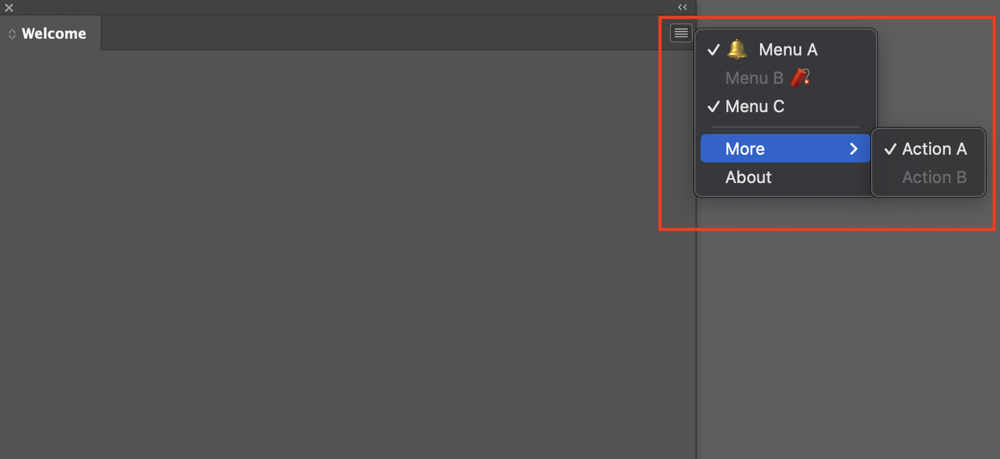
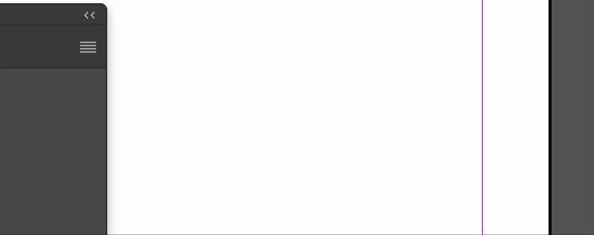

---
keywords:
  - API Documentation
  - UXP
  - Flyout Menu
  - Hamburger Menu
title: Flyout Menus in UXP InDesign
---

# Flyout Menus

A flyout menu in InDesign is shown when the user clicks on the hamburger icon at the top right of your panel. You can use them to invoke operations that, for one reason or another, you don't want to take up real estate on your panel.



<!-- Difference in behavior between scripts and plugins and prerequisites -->
<InlineAlert variant="info" slots="header, text1, text2"/>

Plugins and Scripts

**In plugins**, Supported.

**In scripts**, Not Supported.

## System requirements

Please make sure your local environment uses the following application versions before proceeding.
- InDesign v20.0 or higher

## Defining Flyout Menus

Flyout menus are defined by a JSON structure that's passed to the UXP `entrypoints.setup` method. The JSON tells UXP what the menu items are and what to do when they're invoked. In the following example, there are three space-related menu items. When a menu item is chosen by the user ("invoked"), UXP calls the plugin-defined function `handleFlyout`.

```js
const { entrypoints } = require("uxp");
// The setup() function tells UXP how to handle
// the entrypoints defined in your manifest.json file.
entrypoints.setup({
  panels: {
    my_panel_entrypoint: {
      show() {
        // Put any initialization code for your plugin here.
      },
      menuItems: [
                { id: "menuA", label: "🔔  Menu A", enabled: true, checked: true },  // checked assumed to be false
                { id: "menuB", label: "Menu B 🧨 ", enabled: false },    // ditto
                { id: "menuC", label: "Menu C", checked: true },    // ditto
                "-", //separator
                {  // submenu
                    id: "submenu",
                    label: "More",
                    submenu: [
                        { id: "action1", label: "Action A", enabled: true, }, 
                        { id: "action2", label: "Action B", enabled: false },  
                    ]
                },
                { id: "about", label: "About" }                // enabled assumed to be true
            ],
      invokeMenu(id) {
        handleFlyout(id);
      }
    }
  }
});
```

## Handling Flyouts

The `handleFlyout` function (defined above) gets passed the flyout menu ID. It can use this ID to dispatch code to handle each menu item, as shown below.

```js
function handleFlyout(id) {
  switch (id) {
    case "menuA": {
        console.log("Aye captain");
        break;
    }
    case "menuB": {
        console.log("Bay at 40 percent");
        break;
    }
    case "about": {
        console.log("About to go offline");
        break;
    }
	case "action1" :{
		console.log("Action Time!");
		break;
	}
  }
}
```

## Dynamic Flyout Menu in InDesign UXP Plugin


This documentation explains how to dynamically create and manage a flyout menu in an Adobe InDesign UXP plugin. It covers the lifecycle management, menu structure, and event handling.

### InDesign API

```javascript
const { entrypoints } = require("uxp");
const indesign = require("indesign");
const app = indesign.app;
```

### Flyout Menu Data
A sample dataset of authors is used to populate the menu dynamically:
```javascript
const famousAuthors = [
    {name: 'Virginia Woolf', genre: 'Modernist', type: 'Novelist'},
    {name: 'Gabriel García Márquez', genre: 'Magical Realism', type: 'Novelist'},
    {name: 'Jane Austen', genre: 'Classics', type: 'Poet'}
    // More entries...
];
```

### Entrypoint Setup
```javascript
entrypoints.setup({
    plugin: {
        create() {
            createFlyout(); // create our menu
            console.log('Plugin created');
        },
        destroy() {
            destroyFlyout(); // destroy our menu
            console.log('Plugin destroyed');
        }
    },
    panels: {
        AuthorsPanel: { // Keep original panel name to match plugin ID
            create(rootNode) {
                return new Promise(function (resolve, reject) {
                    resolve();
                })
                .then((response) => {
                    console.log('Panel created');
                })
                .catch((error) => {
                    console.log('Panel creation failed');
                    console.log(error);
                });
            },
            destroy(rootNode) {
                return new Promise(function (resolve, reject) {
                    resolve();
                });
            },
            show(rootNode) {
                return new Promise(function (resolve, reject) {
                    resolve();
                })
                .then((response) => {
                    console.log('Panel shown');
                })
                .catch((error) => {
                    console.log('Panel show failed');
                    console.log(error);
                });
            },
            hide(rootNode) {
                return new Promise(function (resolve, reject) {
                    resolve();
                });
            },
            menuItems: [
                {id:'separator', label:'-'}
            ],
        }
    }
});
```

### Creating the Flyout Menu
The `createFlyout()` function initializes the menu dynamically by waiting for the InDesign menu to be available before adding items.

```javascript
function createFlyout() {
    // Use the original menu name to match existing InDesign menu structure
    const flyoutMenu = app.menus.itemByName('Authors');
    
    // Check if the menu exists before proceeding
    if (!flyoutMenu || !flyoutMenu.isValid) {
        console.error('Authors menu not found');
        return;
    }
    
    destroyFlyout(); // Clear existing menu items
    
    const genreSubmenu = flyoutMenu.submenus.add('Genres');
    genreSubmenu.menuItems.add(_createScriptMenuAction('Authors', 'Genres', 'Classics', {checked:true}));
    genreSubmenu.menuItems.add(_createScriptMenuAction('Authors', 'Genres', 'Modernist'));
    genreSubmenu.menuItems.add(_createScriptMenuAction('Authors', 'Genres', 'All'));
    
    const typeSubmenu = flyoutMenu.submenus.add('Types');
    typeSubmenu.menuItems.add(_createScriptMenuAction('Authors', 'Types', 'Disable Novelists'));
    typeSubmenu.menuItems.add(_createScriptMenuAction('Authors', 'Types', 'Disable Poets'));
    
    flyoutMenu.menuSeparators.add();
    
    const favouritesSubmenu = flyoutMenu.submenus.add('Favourites');
    loadFavouritesSubmenu();
}
```

### Handling Menu Item Actions
A script menu action is created for each menu item. The event listener is triggered when a menu item is selected.
```javascript

function _createScriptMenuAction(theMenuTitle, theSubmenuTitle, theMenuItemTitle, withProperties = {}) {
    withProperties.label = `${theMenuTitle}_${theSubmenuTitle}_${theMenuItemTitle}`;
    const scriptMenuAction = app.scriptMenuActions.add(theMenuItemTitle, withProperties);
    scriptMenuAction.eventListeners.add('onInvoke', function() {
        handleFlyoutInvoke(scriptMenuAction);
    });
    return scriptMenuAction;
}
```

### Destroying the Flyout Menu
The `destroyFlyout()` function cleans up the menu items, submenus, and separators before the plugin is unloaded.
```javascript
function destroyFlyout() {
    const flyoutMenu = app.menus.itemByName('Authors');
    if (flyoutMenu && flyoutMenu.isValid) {
        try {
            // Remove script menu actions
            const allScriptMenuActions = app.scriptMenuActions.everyItem().getElements();
            const filteredScriptMenuActions = allScriptMenuActions.filter(action => 
                action.label && action.label.startsWith('Authors_')
            );
            for (const scriptMenuAction of filteredScriptMenuActions) {
                if (scriptMenuAction && scriptMenuAction.isValid) {
                    scriptMenuAction.remove();
                }
            }
            
            // Remove submenus
            const submenus = flyoutMenu.submenus.everyItem().getElements();
            for (const submenu of submenus) { 
                if (submenu && submenu.isValid) {
                    submenu.remove(); 
                }
            }
            
            // Remove separators (except one)
            if (flyoutMenu.menuSeparators.count() > 1) {
                const separators = flyoutMenu.menuSeparators.everyItem().getElements();
                for (const [idx, separator] of separators.entries()) { 
                    if (idx > 0 && separator && separator.isValid) {
                        separator.remove(); 
                    }
                }
            }
        } catch (e) {
            console.error('Error in destroyFlyout:', e);
        }
    }
}
```

### Handling Menu Item Selections
The `handleFlyoutInvoke()` function processes user interactions based on the selected menu item.
```javascript
function handleFlyoutInvoke(theScriptMenuAction) {
    if (!theScriptMenuAction || !theScriptMenuAction.isValid) {
        console.error('Invalid script menu action');
        return;
    }
    
    const [menuTitle, submenuTitle, menuItemTitle] = theScriptMenuAction.label.split('_');
    const allScriptMenuActions = app.scriptMenuActions.everyItem().getElements();
    
    switch (submenuTitle) {
        case 'Genres': {
            // In this submenu one menu item can be checked (and one is always checked)
            if (!theScriptMenuAction.checked) {
                const genreScriptMenuActions = allScriptMenuActions.filter(action => 
                    action.label && action.label.startsWith('Authors_Genres_')
                );
                for (const action of genreScriptMenuActions) {
                    if (action && action.isValid) {
                        action.checked = action.label === theScriptMenuAction.label;
                    }
                }
                loadFavouritesSubmenu();
            }
        }
        break;
        case 'Types': {
            // Toggle between 'Disable …' and 'Enable …'
            const [enableDisable, type] = theScriptMenuAction.title.split(' ');
            theScriptMenuAction.title = (enableDisable === 'Disable') ? `Enable ${type}` : `Disable ${type}`;
            loadFavouritesSubmenu();
        }
        break;
        case 'Favourites': {
            // Multiple menu items can be checked/unchecked
            theScriptMenuAction.checked = !theScriptMenuAction.checked;
            displayChoicesMade();
        }
        break;
    }
}
```
### Load favourites
The `loadFavouritesSubmenu()` function processes and loads the favourites.
```javascript
function loadFavouritesSubmenu() {
    try {
        const allScriptMenuActions = app.scriptMenuActions.everyItem().getElements();
        const genreScriptMenuActions = allScriptMenuActions.filter(action => 
            action.label && action.label.startsWith('Authors_Genres_')
        );
        
        const checkedAction = genreScriptMenuActions.find(action => action.checked);
        if (!checkedAction) {
            console.error('No genre selected');
            return;
        }
        
        const genreChoice = checkedAction.title;
        
        let authorsToDisplay = [];
        switch (genreChoice) {
            case 'All':
                authorsToDisplay = famousAuthors;
                break;
            case 'Classics':
            case 'Modernist':
            case 'Magical Realism':
                authorsToDisplay = famousAuthors.filter(author => author.genre === genreChoice);
                break;
        }
        
        // Check type filters
        const typeScriptMenuActions = allScriptMenuActions.filter(action => 
            action.label && action.label.startsWith('Authors_Types_')
        );
        
        const novelistScriptMenuAction = typeScriptMenuActions.find(action => 
            action.title && action.title.endsWith('Novelists')
        );
        const novelistsEnabled = novelistScriptMenuAction && 
                               !novelistScriptMenuAction.title.startsWith('Enable');
        
        const poetScriptMenuAction = typeScriptMenuActions.find(action => 
            action.title && action.title.endsWith('Poets')
        );
        const poetsEnabled = poetScriptMenuAction && 
                           !poetScriptMenuAction.title.startsWith('Enable');
        
        // Get and verify the flyout menu
        const flyoutMenu = app.menus.itemByName('Authors');
        if (!flyoutMenu || !flyoutMenu.isValid) {
            console.error('Authors menu not found');
            return;
        }
        
        // Get and verify the favorites submenu
        const favouritesSubmenu = flyoutMenu.submenus.itemByName('Favourites');
        if (!favouritesSubmenu || !favouritesSubmenu.isValid) {
            console.error('Favourites submenu not found');
            return;
        }
        
        // Remove existing menu items in favorites submenu
        try {
            const existingMenuItems = favouritesSubmenu.menuItems.everyItem().getElements();
            for (const menuItem of existingMenuItems) {
                if (menuItem && menuItem.isValid) {
                    menuItem.remove();
                }
            }
        } catch (e) {
            console.error('Error clearing favorites:', e);
        }
        
        // Add new menu items
        for (const author of authorsToDisplay) {
            const props = {
                enabled: author.type === 'Novelist' ? novelistsEnabled : poetsEnabled
            };
            favouritesSubmenu.menuItems.add(_createScriptMenuAction('Authors', 'Favourites', `${author.name} (${author.type})`, props));
        }
    } catch (e) {
        console.error('Error in loadFavouritesSubmenu:', e);
    }
}
```
### Display the choices
The `displayChoicesMade()` function prints the selected items on console.
```javascript
function displayChoicesMade() {
    try {
        const allScriptMenuActions = app.scriptMenuActions.everyItem().getElements();
        const favouriteScriptMenuActions = allScriptMenuActions.filter(action => 
            action.label && 
            action.label.startsWith('Authors_Favourites_') && 
            action.checked
        );
        
        const selectedFavorites = favouriteScriptMenuActions.map(action => action.title);
        console.log('Selected favorites:', selectedFavorites);
    } catch (e) {
        console.error('Error in displayChoicesMade:', e);
    }
}
```


