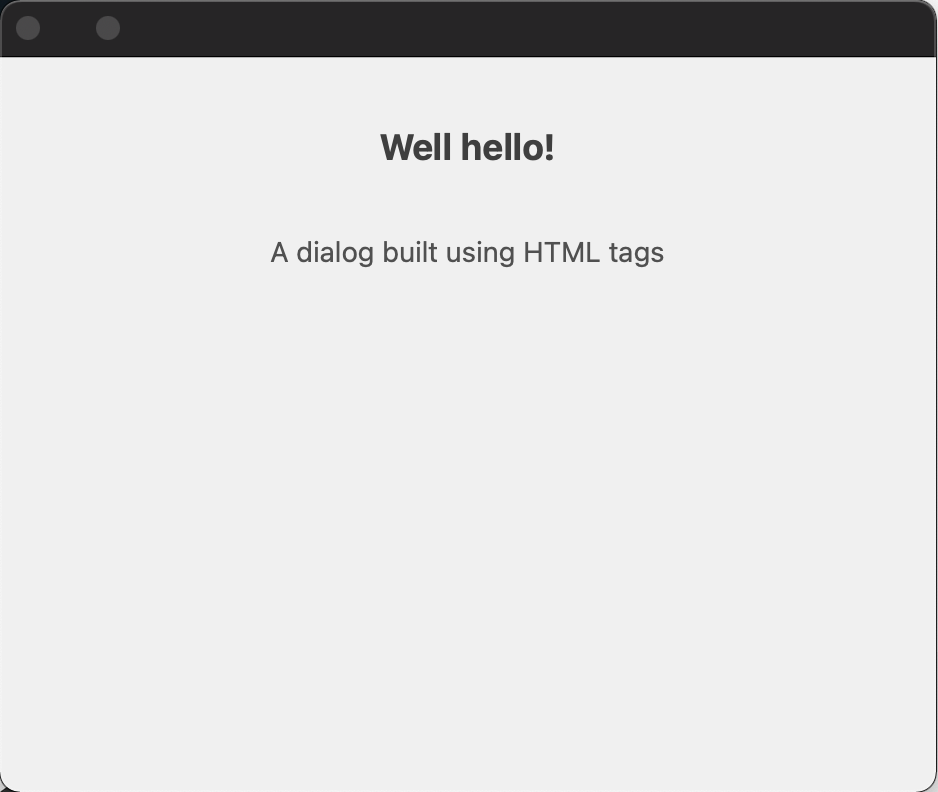

# HTML Elements

UXP core APIs let you create renditions but depending on whether you are writing scripts or plugins, you can create UI either by using HTML tags or just stick to JavaScript.

## System requirements
Please make sure your local environment uses the following application versions before proceeding.
- InDesign v18.5 or higher
- UXP version v7.1 or higher
- Manifest version v5 or higher


<InlineAlert variant="info" slots="header, text1, text2"/>

Scripts and plugins

**In scripts**, you only have the option to create UI from the `.idjs` script (JavaScript) file. Moreover, remember that scripts only allow you to create UI within a modal dialog.

**In plugins**, a panel can be created both ways - using HTML tags or JavaScript. However, command plugins behave similarly to scripts and can create only modal dialogs from JavaScript.

Let's take 'dialog' as an example and demonstrate both ways. You can extend the same principle to other HTML Elements

## Using HTML
<!-- Provide a simple example using code snippets -->

<CodeBlock slots="heading, code" repeat="3" languages="HTML, JavaScript, CSS" />

#### HTML
```html
<button id="showDialog">Show Dialog</button>
<dialog id="sampleDialog">
    <div>
        <h1>Well hello!</h1>
        <p>A dialog built using HTML tags</p>
    </div>
</dialog>
```

#### JavaScript
```js
const showDialogBtn = document.getElementById("showDialog");
showDialogBtn.addEventListener("click", showDialog);
function showDialog() {
    const dialog = document.getElementById("sampleDialog");
    dialog.show();
    dialog.addEventListener("cancel", () => {
        console.log("Dialog dismissed");
    });
}
```

#### CSS
```css
#sampleDialog > div {
    display: flex;
    flex-direction: column;
    height: 300px;
    width: 400px;
    align-items: center;
}
#sampleDialog > div > p {
    margin-top: 30px;
}
```

## Using only JavaScript

<CodeBlock slots="heading, code" repeat="2" languages="HTML, JavaScript" />

#### HTML
```html
<button id="showDialog">Show Dialog</button>
```

#### JavaScript
```js
const showDialogBtn = document.getElementById("showDialog");
showDialogBtn.addEventListener("click", showDialog);
function showDialog() {
    // create dialog 
    const dialog = document.createElement("dialog");  
  
    const div = document.createElement("div");
    div.style.display = "flex";
    div.style.flexDirection = "column";
    div.style.height = "300px";
    div.style.width = "400px";
    div.style.alignItems = "center";
  
    const header = document.createElement("h1");
    header.textContent = "Well hello!!";
    div.appendChild(header);

    const para = document.createElement("p");
    para.textContent = "A dialog built using HTML tags";
    div.appendChild(para);
  
    dialog.appendChild(div);
    
    // show dialog
    document.body.appendChild(dialog).showModal();
    
    dialog.addEventListener("cancel", () => {
        console.log("Dialog dismissed");
    });
}
```



## Additional notes
- Creating dialogs within scripts can sometimes be a little tricky requiring you to handle the showing/hiding with async/promises. Check out the script tutorial on modal dialogs.<!--// TODO add linkI>

## Reference material
- [Dialog Element](/indesign/uxp/reference/uxp-api/reference-js/Global%20Members/HTML%20Elements/HTMLDialogElement/)
- [Other HTML Elements](/indesign/uxp/reference/uxp-api/reference-js/Global%20Members/HTML%20Elements/)

