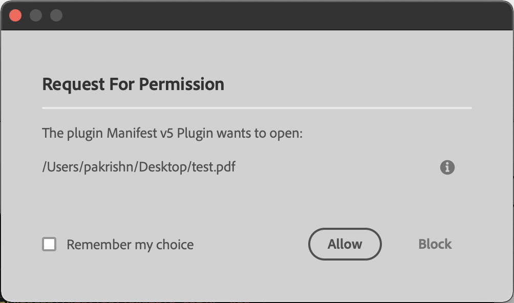
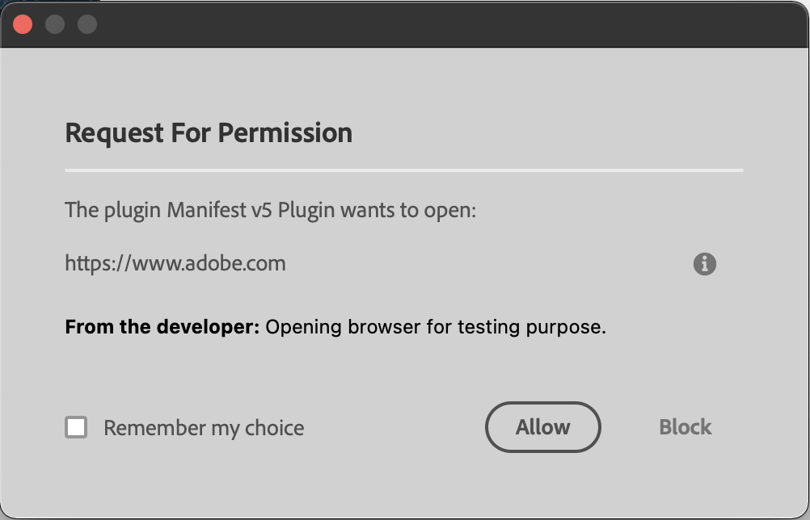

# Launch process
UXP core APIs also offer `shell` APIs to launch processes in the user's system.


There are primarily two things you can do with the help of these APIs
1. Open a file using the standard application. For example, open a PDF in Acrobat Reader.
2. Launch applications. For example, open the mail client with an email address.

Before we take a look at some examples, you must know that these APIs are associated with the `launchProcess` permission in the manifest. 

<InlineAlert variant="info" slots="header, text1, text2"/>

Plugins and Scripts

**In plugins**, you should specify the schemes and file extensions in the `launchProcess` permission in your manifest for it to work.<br></br> 
IMPORTANT: Please read about the [manifest permissions](../../../plugins/concepts/manifest/#permissionsdefinition) module before you proceed.

**In scripts**, the permission for `launchProcess` is fixed. You can ignore the manifest details in the following examples. Learn about these values in the [manifest fundamentals section](../../fundamentals/manifest/). 


## System requirements
Please make sure your local environment uses the following application versions before proceeding.
- InDesign v18.5 or higher
- UDT v1.9.0 or higher
- Manifest version v5 or higher

## Opening a file

For opening a file, you must provide the full path of the file and specify the `extensions` of the files you are about to access in the plugin manifest.

### Example

<CodeBlock slots="heading, code" repeat="2" languages="JavaScript, JSON" />

#### JavaScript
```js
async function foo() {
    const { shell }  = require("uxp");
    try {
        await shell.openPath("/Users/user/Desktop/test.pdf");
    } catch (e) {
        console.error(e);
    }
}
```

#### manifest
```json
{
    "launchProcess": {
        "extensions": [".pdf"]
    }
}
```




## Launch a process
You can open an application in the user's system with the help of URL Schemes

### Example

<CodeBlock slots="heading, code" repeat="2" languages="JavaScript, JSON" />

#### JavaScript
```js
async function foo() {
    const { shell }  = require("uxp");
    try {
        await shell.openExternal("https://www.adobe.com", "Opening browser for testing purpose.");
        await shell.openExternal("mailto:/example.com/");
    } catch (e) {
        console.error(e);
    }
}
```

#### manifest
```json
{
    "launchProcess": {
        "schemas": ["https", "mailto"]
    }
}
```



## Additional notes
- The user will be asked to provide their consent for such operations. Give more context to the user by adding a note. For example the message "Opening browser for testing purpose." in the above example.
- Be prepared in case the user denies the request.
- While using `openExternal`, keep in mind, that URL schemes are operating system specific. For example, `facetime` is not available in Windows. Same with custom schemes. Add pre-checks and use standard URL schemes to avoid unexpected errors.


## Reference material
- [Shell API](/indesign/uxp/reference/uxp-api/reference-js/Modules/shell/Shell/)

