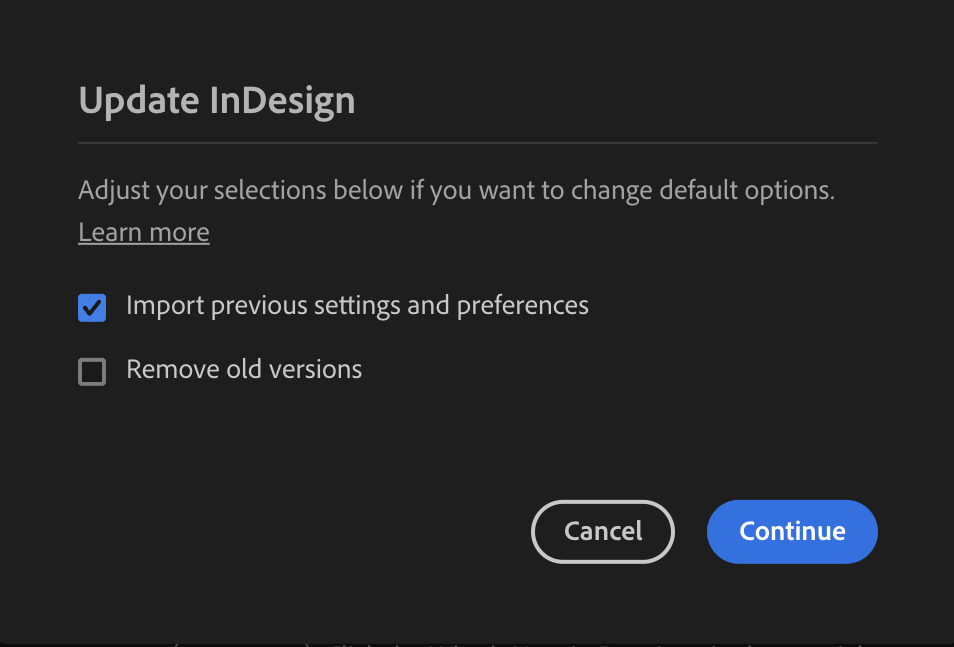

---
keywords:
  - API Documentation
  - UXP
  - Plugin Storage
  - Persistent Storage
  - Scripting
title: Persistent Storage Migration in InDesign UXP

---

# Persistent Storage Migration
Persistent storage migration in InDesign allows users to seamlessly carry over plugin data from one version to the next. By selecting the 'Import Previous Settings and Preferences' option during installation, users can ensure that their plugin data is preserved when upgrading to the latest version of InDesign.


<InlineAlert variant="info" slots="header, text1, text2"/>

Plugins and Scripts

**In plugins**, Supported.

**In scripts**, Not Supported.


## System requirements
Please make sure your local environment uses the following application versions before proceeding.
- InDesign v20.0 or higher

## Import Previous Settings and Preferences



While installing the new InDesign version, if the "Import Previous Settings and Preferences" option is selected in the Creative Cloud Desktop (CCD) app, the plugin data would be copied to the following folder locations:


**Plugins Installed from CCD or Plugin Market Place (External)**

- **Windows:**

  `AppData\Roaming\Adobe\UXP\PluginsStorage\IDSN\{App Version}\External`

- **MAC:**

  `Library/Application Support/Adobe/UXP/PluginsStorage/IDSN/{App Version}/External`

**Plugins Installed from UDT or Developer Plugins (Developer)**

- **Windows:**

  `AppData\Roaming\Adobe\UXP\PluginsStorage\IDSN\{App Version}\Developer`

- **MAC:**

  `Library/Application Support/Adobe/UXP/PluginsStorage/IDSN/{App Version}/Developer`


  
## Specifying plugin data using Local File Storage
The plugin data folders can be accessed with the following API:
```js
// Import the required module from UXP for file system access
const uxp = require('uxp');
const fs = uxp.storage.localFileSystem;

// Example: Access the folder where plugin data can be stored
(async () => {
    try {
        // Get the data folder (persistent storage location)
        const folder = await fs.getDataFolder();
        
        // Example: Log the folder object or use it for further operations
        console.log('Data folder:', folder);
        
        // Perform additional actions with the folder, such as reading/writing files
        // const file = await folder.createFile('example.txt', { overwrite: true });
        // await file.write('This is an example content.');
        
    } catch (error) {
        console.error('Error accessing the folder:', error);
    }
})();
```