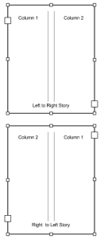

# Middle Eastern Scripting Guide
The Middle Eastern feature of InDesign Server provides support for designing and publishing documents in Middle Eastern languages. 

This gives you unprecedented capability to build multilingual publications, mixing Roman and Middle Eastern scripts with ease and flexibility in your layouts.

This section shows how to use Middle Eastern features with scripting. This section assumes that you are familiar with Middle Eastern features in InDesign.

## Setting up a document

### Setting page binding
In a Roman publication, the binding of documents is always on the left. Conversely, in an Arabic or Hebrew publication, binding is on the right. With InDesign Server, you can create a document in which the pages are bound on the left edge or on the right edge. From InDesign Scripting, you can control this using the pageBinding property. This property is part of the DocumentPreferences object and can get one value from the PageBindingOptions enumeration (default, leftToRight or rightToLeft).

The following sample script creates a new document, and then sets or gets the page binding for the created document (for the complete script, see PageBinding).

```js
const { app } = require("indesign");
var myDocument = app.documents.add();
with(myDocument ){
    //set number of pages
    documentPreferences.pagesPerDocument = 4;
    //set binding options for the document
    documentPreferences.pageBinding = PageBindingOptions.rightToLeft;
}
```

## Numbering
InDesign Server comes with special styles for page, paragraph, and footnote numbering. You can choose to apply standard, Arabic (Arabic Abjad and Arabic Alif Ba Tah) or Hebrew (Hebrew Biblical Standard and Hebrew Non-Standard Decimal) styles. With InDesign scripting, you can access these settings with the PageNumberStyle and FootnoteNumberingStyle properties.

### Settings for page numbering
The following script shows how to set these settings for pages (for the complete script, see NumberingME).

```js
myDocument.sections.item(0).pageNumberStyle = PageNumberStyle.arabicAlifBaTah;
myDocument.sections.item(1).pageNumberStyle = PageNumberStyle.arabicAbjad;
```

### Settings for footnote numbering
The following script shows how to set ME numbering settings for footnotes (for the complete script, see NumberingME):

```js
myDocument.footnoteOptions.footnoteNumberingStyle = FootnoteNumberingStyle.hebrewBiblical;
```

## Setting composer
The composer that is used to create text frames in a Roman publication is different from the ME Composer. InDesign Server comes with a document method changeComposer that can be used in a Roman publication to changes the composer for all text frames to the Adobe World-Ready Composer. Adobe Paragraph Composer is changed to Adobe World-Ready Paragraph Composer; Adobe Single-line Composer is changed to Adobe World-Ready Single-line Composer.

The following script shows how to use this method (for the complete script, see ChangeComposer):

```js
myDocument.changeComposer();
```

## Working with text

### Inserting special ME character

Using enumerations, InDesign Server gives you the ability to insert three Hebrew characters (Geresh, Gershayim, Maqaf) and four Arabic ones (Kashida, Arabic comma, Arabic Semicolon, and Arabic Question mark), as well as a right-to-left marker or left-to-right marker. The following script shows how to insert special Middle Eastern characters (for the complete script, see SpecialCharactersME).

```js
const { SpecialCharacters } = require("indesign");
//Entering InDesign special ME characters by their enumerations:
myTextFrame.parentStory.insertionPoints.item(-1).contents = "Hebrew Maqaf: ";
myTextFrame.parentStory.insertionPoints.item(-1).contents = SpecialCharacters.hebrewMaqaf;
myTextFrame.parentStory.insertionPoints.item(-1).contents = "\r";
myTextFrame.parentStory.insertionPoints.item(-1).contents = "Hebrew Geresh: ";
myTextFrame.parentStory.insertionPoints.item(-1).contents = SpecialCharacters.hebrewGeresh;
myTextFrame.parentStory.insertionPoints.item(-1).contents = "\r";
myTextFrame.parentStory.insertionPoints.item(-1).contents = "Hebrew Gershayim: ";
myTextFrame.parentStory.insertionPoints.item(-1).contents = SpecialCharacters.hebrewGershayim;
myTextFrame.parentStory.insertionPoints.item(-1).contents = "\r";
myTextFrame.parentStory.insertionPoints.item(-1).contents = "Arabic Kashida: ";
myTextFrame.parentStory.insertionPoints.item(-1).contents = SpecialCharacters.arabicKashida;
myTextFrame.parentStory.insertionPoints.item(-1).contents = "\r";
myTextFrame.parentStory.insertionPoints.item(-1).contents = "Arabic Comma: ";
myTextFrame.parentStory.insertionPoints.item(-1).contents = SpecialCharacters.arabicComma;
myTextFrame.parentStory.insertionPoints.item(-1).contents = "\r";
myTextFrame.parentStory.insertionPoints.item(-1).contents = "Arabic Semicolon: ";
myTextFrame.parentStory.insertionPoints.item(-1).contents = SpecialCharacters.arabicSemicolon;
myTextFrame.parentStory.insertionPoints.item(-1).contents = "\r";
myTextFrame.parentStory.insertionPoints.item(-1).contents = "Arabic Question Mark: ";
myTextFrame.parentStory.insertionPoints.item(-1).contents = SpecialCharacters.arabicQuestionMark;
myTextFrame.parentStory.insertionPoints.item(-1).contents = "\r";
myTextFrame.parentStory.insertionPoints.item(-1).contents = "Right To Left Mark: ";
myTextFrame.parentStory.insertionPoints.item(-1).contents = SpecialCharacters.rightToLeftMark;
myTextFrame.parentStory.insertionPoints.item(-1).contents = "\r";
myTextFrame.parentStory.insertionPoints.item(-1).contents = "Left To Right Mark: ";
myTextFrame.parentStory.insertionPoints.item(-1).contents = SpecialCharacters.leftToRightMark;
myTextFrame.parentStory.insertionPoints.item(-1).contents = "\r";
```

### Finding and replacing ME text

With InDesign scripting, you can find and replace Middle Eastern text. The following sample script shows how to find and replace words in the Middle Eastern text (for the complete script, see MENAFindAndReplaceText).

```js
const { NothingEnum } = require("indesign");
var myDocument = app.documents.add();
//Clear the find/change text preferences.
app.findTextPreferences = NothingEnum.nothing;
app.changeTextPreferences = NothingEnum.nothing;
//Search the document for the string "Adobe".
app.findTextPreferences.findWhat = "أدوبي";
//Set the find options.
app.findChangeTextOptions.caseSensitive = false;
app.findChangeTextOptions.includeFootnotes = false;
app.findChangeTextOptions.includeHiddenLayers = false;
app.findChangeTextOptions.includeLockedLayersForFind = false;
app.findChangeTextOptions.includeLockedStoriesForFind = false;
app.findChangeTextOptions.includeMasterPages = false;
app.findChangeTextOptions.wholeWord = false;
var myFoundItems = myDocument.findText(); Converting an InDesign script to InDesign Server
app.findTextPreferences = NothingEnum.nothing;
app.changeTextPreferences = NothingEnum.nothing;
//Replace the text in myString
for(var i = 0; i < myFoundItems.length; i++)
{
    myFoundItems[i].contents = "Adobe";
}
```

## Setting story direction property



With InDesign Scripting, if you need to change the main direction of an existing text story, even after typing or placing some text inside, use the storyDirection property. This property is part of the StoryPreferences object and can get one value from the StoryDirectionOptions enumeration (leftToRightDirection and rightToLeftDirection). The following sample script creates a two-column text frame, then sets the story direction (for the complete script, see StoryDirection).

```js
const { Justification, StoryDirectionOptions } = require("indesign");
with(myTextFrame){
    //Set the bounds of the text frame.
    geometricBounds = [70, 200, 300, 500];
    //Fill the text frame with placeholder text in 2 column.
    textFramePreferences.textColumnCount = 2;
    contents = "أدوات التصميم القوية والمتكاملة رقم 1 من أدوبي"
    parentStory.justification =  Justification.rightJustified;
    //Now set the story direction left to right
    parentStory.storyPreferences.storyDirection = StoryDirectionOptions.leftToRightDirection;
}
```

## Setting paragraph attributes
InDesign Server comes with special paragraph settings, such as Paragraph Direction and Justification, for laying out Arabic/Hebrew text.

### ParagraphDirection
Paragraph direction controls the order of multidirectional text inside the paragraph. By default, the paragraph direction is Left To Right.

With InDesign scripting, if you need to change the main direction of an existing paragraph, use the paragraphDirection property. This property is part of the Text objects and can get one value from the ParagraphDirectionOptions enumeration (leftToRightDirection and rightToLeftDirection). The following sample script shows how to set this property (for the complete script, see MEParagraphAttributes).

```js
const { ParagraphDirectionOptions } = require("indesign");
with(myTextFrame){
    //Set ME paragraph attributes.
    paragraphs.item(0).paragraphDirection = ParagraphDirectionOptions.leftToRightDirection;
}
```

### Paragraph direction for application and document
You can also use this property to set text defaults both for the application and for each document:

```js
const { ParagraphDirectionOptions } = require("indesign");
myDocument.textDefaults.paragraphDirection = ParagraphDirectionOptions.rightToLeftDirection;
```

## Justification
With InDesign scripting, you can change the default or the existing attribute of a paragraph with the ParagraphJustification property. This property is part of the Text objects and can get one value from the ParagraphJustificationOptions enumeration (defaultJustification, arabicJustification, and naskhJustification). The following sample script shows how to set this property (for the complete script, see MEParagraphAttributes).

### Justification for an existing paragraph

```js
const { ParagraphDirectionOptions } = require("indesign");
with(myTextFrame){
    //Set ME paragraph attributes.
    paragraphs.item(1).paragraphJustification = ParagraphJustificationOptions.naskhJustification;
}
```

### Justification for text defaults

```js
const { ParagraphDirectionOptions } = require("indesign");
myDocument.textDefaults.paragraphJustification = ParagraphJustificationOptions.arabicJustification;
```

## Setting character attributes
InDesign Server comes with special character settings for laying out Arabic/Hebrew text. These settings allow you to finely tune your Arabic/Hebrew text. With InDesign scripting, these settings correspond to a number of properties that can be applied to a Text object. The MECharactrsAttributes tutorial script shows how to set every Middle Eastern property of a text object.

### Digits
You can choose the language in which you want your numeric digits to be displayed. The Default setting means that the numbers will be in the same language as that of the previous character. Otherwise, you can choose between Arabic, Hindi, and Farsi numbers. The corresponding text object property is DigitsType.

```js
const { DigitsTypeOptions } = require("indesign");
myTextFrame.contents = "Farsi Digits: 1234567890";
myTextFrame.paragraphs.item(0).digitsType = DigitsTypeOptions.farsiDigits;
```

### Kashidas
The Arabic and Naskh justification algorithms insert kashidas and spaces. If you don't want Kashidas to be inserted in the Arabic text, with InDesign scripting, you can change the Kashidas property to set it to kashidasOff; otherwise, set it to defaultKashidas.

```js
const { KashidasOptions, Justification, ParagraphJustificationOptions } = require("indesign");
myTextFrame.contents = "كُتِبَ Kashidas Off";
myTextFrame.paragraphs.item(0).kashidas = KashidasOptions.kashidasOff;
myTextFrame.paragraphs.item(0).justification = Justification.fullyJustified;
myTextFrame.paragraphs.item(0).paragraphJustification = ParagraphJustificationOptions.naskhJustification;
```

### Characters direction
To correctly handle bidirectional text, InDesign Server stores character direction information. With scripting, this information can be changed using the CharacterDirection property which can get one value from the CharacterDirectionOptions enumeration (defaultDirection, leftToRightDirection and rightToLeftDirection).

```js
const { CharacterDirectionOptions } = require("indesign");
myTextFrame.contents = "Farsi + L dir: 1234567890";
for (i=15 ; i < 25 ; i++) {
    myTextFrame.parentStory.characters.item(i).characterDirection = CharacterDirectionOptions.leftToRightDirection;
}
```

### Diacritic positioning
Short Arabic vowels are floating diacritics, written either over or under the consonants. Therefore, it is important that the diacritics be properly placed over the consonants, both horizontally and vertically.

Diacritic Positioning can be accessed with scripting using the DiacriticPosition to choose from five predefined positions (defaultPosition, loosePosition, mediumPosition, tightPosition, and opentypePosition) or a custom position using the XOffsetDiacritic for horizontal adjustment and YOffsetDiacritic for vertical adjustment.

```js
const { DiacriticPositionOptions } = require("indesign");
myTextFrame.contents = "كُتِبَ Loose";
myTextFrame.paragraphs.item(0).diacriticPosition = DiacriticPositionOptions.loosePosition;
myTextFrame.contents = "كُتِبَ Custom";
myTextFrame.parentStory.characters.item(1).xOffsetDiacritic = 150;
myTextFrame.parentStory.characters.item(1).yOffsetDiacritic = -150;
```

### Open Type features
If you are using an Open Type Font in your layout, then you have access to special Open Type features. These features can be accessed with scripting using the OtfOverlapSwash, OtfStylisticAlternate, OtfJustificationAlternate, or OtfStretchedAlternate properties.

```js
myTextFrame.paragraphs.item(0).otfOverlapSwash = true;
myTextFrame.paragraphs.item(0).otfStylisticAlternate = true;
myTextFrame.paragraphs.item(0).otfJustificationAlternate = true;
myTextFrame.paragraphs.item(0).otfStretchedAlternate = true;
```

## Using styles
Paragraph and character styles are the keys to text formatting productivity and should be a central part of any script that applies text formatting. While creating a Character or Paragraph style, you will access all the preceding explained Character and Paragraph attribute properties on the CharacterStyles and ParagraphStyles Objects.

The following example script fragment shows how to create paragraph and character styles with Middle Eastern attributes (for the complete script, see CreateStylesME).

```js
const { DigitsTypeOptions, CharacterDirectionOptions, ParagraphDirectionOptions,  ParagraphJustificationOptions, KashidasOptions, DigitsTypeOptions } = require("indesign");
//Create a character style named "myCharacterStyleME" if
//no style by that name already exists.
try{
    myCharacterStyleME = myDocument.characterStyles.item("myCharacterStyleME");
    //If the style does not exist, trying to get its name will generate an error.
    myName = myCharacterStyleME.name;
}
catch (myError){
    //The style did not exist, so create it.
    myCharacterStyleME = myDocument.characterStyles.add({name:"myCharacterStyleME"});
}
with(myCharacterStyleME){
    appliedFont = app.fonts.item("Adobe Arabic");
    digitsType = DigitsTypeOptions.farsiDigits;
    characterDirection = CharacterDirectionOptions.leftToRightDirection;
}
//Create a paragraph style named "myParagraphStyle" if
//no style by that name already exists.
try{
    myParagraphStyleME = myDocument.paragraphStyles.item("myParagraphStyleME");
    //If the paragraph style does not exist, trying to get its name will generate an error.
    myName = myParagraphStyleME.name;
}
catch (myError){
    //The paragraph style did not exist, so create it.
    myParagraphStyleME = myDocument.paragraphStyles.add({name:"myParagraphStyleME"});
}
with(myParagraphStyleME){
    justification =  Justification.fullyJustified;
    paragraphDirection = ParagraphDirectionOptions.rightToLeftDirection;
    paragraphJustification = ParagraphJustificationOptions.naskhJustification;
    pointSize = 12;
    kashidas = KashidasOptions.defaultKashidas;
    digitsType = DigitsTypeOptions.hindiDigits;
    appliedFont = app.fonts.item("Adobe Arabic");
    otfJustificationAlternate = true;
}
```