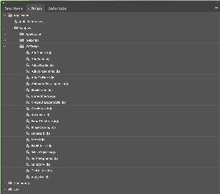

# Starters and samples
To help you start writing scripts and plugins to solve real world problems, you can use our sample and starter templates.

**Scripts**  
InDesign has a bunch of sample UXP Scripts readily available within the app. Find them under Windows-> Utilities -> Scripts panel. 

For additional samples, look at the [repo](https://github.com/AdobeDocs/uxp-indesign-samples/scripts).

**Plugins**   
You can find samples and starter for plugins [here](https://github.com/AdobeDocs/uxp-indesign-samples).
Consider 'samples' to be working example of a specific feature. Whereas, a 'starter' is meant to assist you with framework setup. We recommend you begin by exploring the kitchen-sink for UXP Spectrum widgets (//TODO add link to kitchen sink) to understand all the available UI controls in UXP. 

  

If you are looking for a basic template for scripts/plugins, use first-script-starter.idjs and first-plugin-starter. // TODO add links to starter.
Alternatively, you can select starter plugins from UDT while 'Creating' a plugin.

Remember, that examples within scripts can also be used within plugins, and vice versa. After all, you can think of plugins as scripts + sophisticated UI controls + manifest configuration. 

We would love to add more samples that cover relevant use cases. Please help us by contributing to the repo and sharing your work with the community. Create a pull request and tag us for review.
 