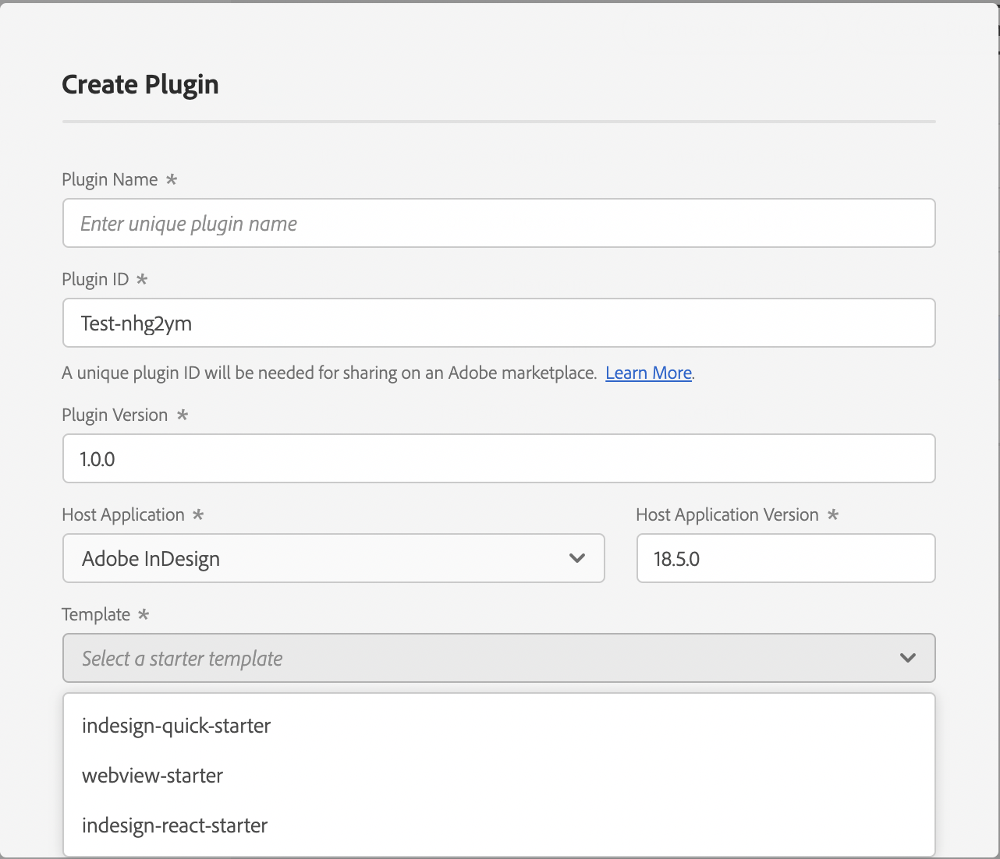
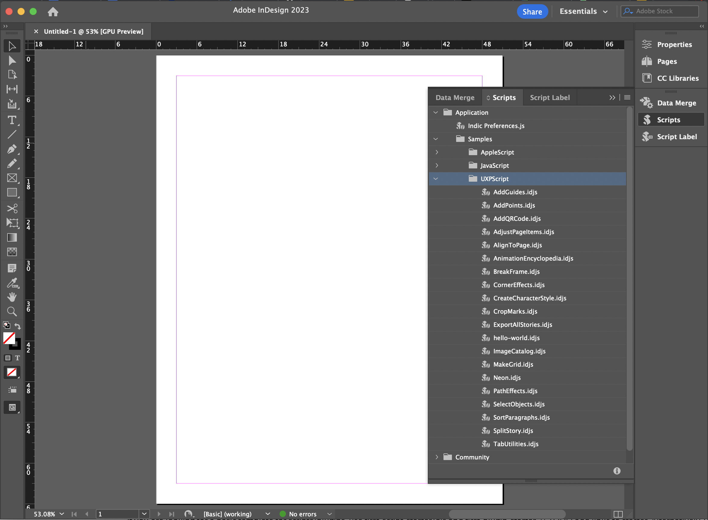

# Starters and samples
To help you start writing scripts and plugins to solve real-world problems, you can use the samples and starter templates.

Consider 'samples' to be a working example of a specific feature. Whereas, a 'starter' is meant to assist you with the framework setup.

## Git repo
You can find samples and starters for scripts/plugins [here](https://github.com/AdobeDocs/uxp-indesign-samples). 

## UDT
Additionally, UDT also provides a few templates that you can choose from while creating a new plugin.   

## In-app helpers
InDesign has a bunch of sample UXP Scripts readily available within the app. Find them under Windows-> Utilities -> Scripts panel.   

## Recipes
The next section of [recipes](../recipes/) also has examples of common use cases. 

     

Remember, that examples within scripts can also be used within plugins, and vice versa. After all, you can think of UXP plugins as UXP scripts + sophisticated UI controls + manifest configurations. 

We would love to add more samples that cover relevant use cases. Please contribute to the repo and share your work with the community. Create a pull request and tag us for review.
 