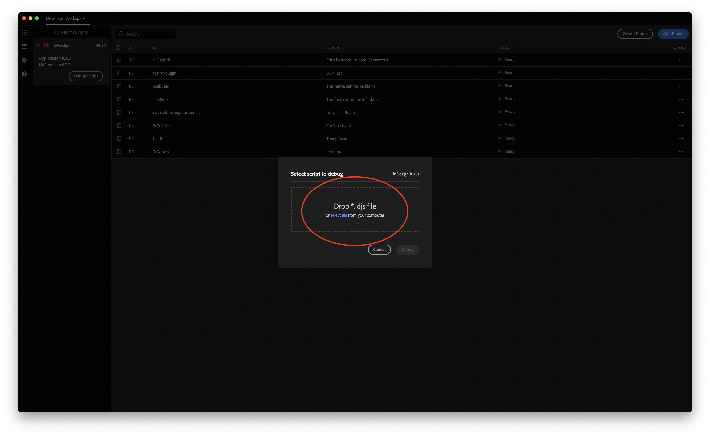

<!-- Status -->
<TitleBlock slots="heading, text" theme="light" />

### Status: Needs clean up

Author: Extensibility team (@pakrishn)   
<!-- End of status -->

# Debugging a Script
This page goes over how to debug common problems you may run into while using InDesign Scripting. 

* The UXP logs and console.log from script gets written to path `/Users/<user name>/Library/Caches/UXPLogs/` in Mac and `C:\Users\<username>\AppData\Local\Temp\UXPLogs` in Windows. If you find multiple files in the location, pick the one with the latest timestamp.
* All the sample scripts have a try /catch block. Any exceptions raised from the InDesign side can be caught and dumped to the console or displayed on the dialog box.
* Interpreter parsing errors go directly to the UXP logs.
* User can print any message using ‘console.log(formatted message). Messages will appear in a log file.

## Debugging Script files using UDT

Script files are executed in a context that is mostly the same as those used in UXP plugins. Using [UXP Developer Tool](https://creativecloud.adobe.com/apps/download/uxp-developer-tools) (UDT) version 1.7.0, you can step through and debug a script.

You can debug script files in UDT by clicking on "Connected Apps", choosing InDesign, and then adding your script from there:

Once you've loaded a script in, you can debug with a breakpoint activated. From here you set breakpoints or Step Into the script files. 