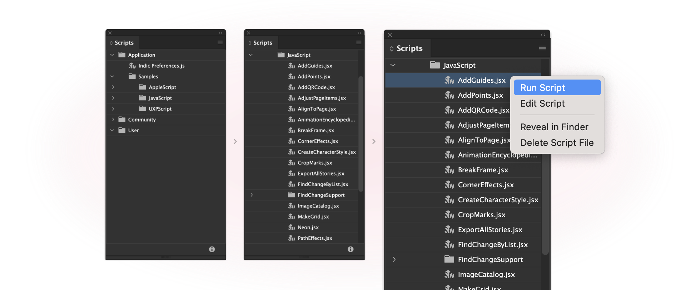

# Building your first script

This tutorial will walk you through the process of building your first script. You will learn how to create a script, and then run it in InDesign.

## Prerequisites

Before you start, make sure you have the following software installed on your machine:

- **InDesign 2023 (v18.0)** or later (can be installed from the _Creative Cloud Desktop_ app)
- **UXP Developer Tool v1.7** (can be [installed from the _Creative Cloud Desktop_ app](https://creativecloud.adobe.com/apps/download/uxp-developer-tools))
- A **code editor** of your choice (for example, [Visual Studio Code](https://code.visualstudio.com/))

## Steps

### Step 1: Create a script

Open your code editor and create a plain text file and add the following JavaScript code snippet to it.

```js
let { app } = require("indesign");
let myDocument = app.documents.add();
let myTextFrame = myDocument.pages.item(0).textFrames.add();

// set the geometric bounds, the top, left, bottom, and right edges, of the text frame.
myTextFrame.geometricBounds = ["6p", "6p", "24p", "24p"];
myTextFrame.contents = "Hello World!";
```

**Remember** that an `idjs` file is a mere JavaScript file with a special extension to identify it as a UXP script for InDesign.

### Step 2: Save the file to Scripts panel

Scripts can only be executed once they appear in the Scripts panel. To add your scripts to the panel, you have two options
1. Save your scripts to the InDesign application scripts folder.<br></br>
    macOS - `/Applications/Adobe InDesign 2023/Scripts` <br></br>
    Windows - <!-- //TODO path? --> <br></br>
    (Create the Scripts folder if it does not already exist but this may require admin access.)
2. Alternatively, put the script inside the Scripts Panel folder in your preferences folder. Your preferences folder is at: <br></br>
    macOS: `/Users/<username>/Library/Preferences/Adobe InDesign/Version 18.0/<locale>/Scripts` <br></br>
    Windows: `C:\Users\<username>\AppData\Roaming\Adobe\InDesign\Version 18.0\<locale>\Scripts` <br></br>
    Above, `<username>` is your user name and `<locale>` references your location and language, for example, en_US.

Save the script as a plain-text file with the `.idjs` file extension.

### Step 3: Run the script

Now that you have created your script, you can run it in InDesign. Open the Scripts panel by selecting Window > Utilities > Scripts menu option. 

Find your saved script, and then double-click on the script name. You can also right-click on the script name and then click on `run` in the drop-down menu.




### Step 4: Make a change

Now that you have your script running in InDesign, let's make a slight change to see how it works.

To edit a script shown in the Scripts panel, select the script and choose 'Edit Script' from the menu. This should open your script in a text editor.

Let's add the following, to update the font and size of the text

```js
let myFont = app.fonts.item("Arial");
let myPage = myDocument.pages.item(0);

var myParagraph = myTextFrame.paragraphs.item(0);
myParagraph.appliedFont = myFont;
myParagraph.pointSize = 48;
```

To see your changes, you'll need to save the changes and rerun the script by double-clicking on it from the Scripts panel.


## Next steps

Congratulations! You have successfully created your first script in InDesign. Next, we'll take a look at some of the concepts that are important for script development.
