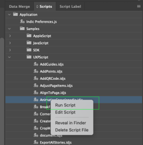

<!-- Status -->
<TitleBlock slots="heading, text" theme="light" />

### Status: Needs work

Author: Extensibility team (@pakrishn)   
Needs inputs from InDesign team   
<!-- End of status -->

<!-- Detailed steps to run the scripts in InDesign, InDesign Server and InDesign Cloud Service 

Make sure the RIGHT nav items are ID, IDS, and IDCS
-->

# InDesign

## Installing scripts

Installing an InDesign script is easy: add the script file to the scripts folder so that it shows up in the Scripts panel.  inside the Scripts folder in your InDesign application folder (/Applications/Adobe\ InDesign\ 2023\ \(Prerelease-Debug\)/Scripts). (Create the Scripts folder if it does not already exist.) Note: this may require admin access.

Alternately, put the script inside the Scripts Panel folder in your preferences folder. Your preferences folder is at:

Windows: `C:\Users\<username>\AppData\Roaming\Adobe\InDesign\Version 18.0\<locale>\Scripts`
Mac: `/Users/<username>/Library/Preferences/Adobe InDesign/Version 18.0/<locale>/Scripts`
Above, `<username>` is your user name and `<locale>` references your location and language, for example, en_US.

Once the script is in the folder, it appears on the Scripts panel inside InDesign. To display the panel, choose Window > Utilities > Scripts.

You  can also put aliases/shortcuts to scripts (or folders containing scripts) in the Scripts Panel folder, and they will appear in the Scripts panel.

To run a specific script when InDesign starts, put it inside a folder named "Startup Scripts" inside the Scripts folder (create this folder if it does not already exist).

## Running a script

To run a script, display the Scripts panel (choose Window > Utilities > Scripts), then double-click the script name in the Scripts panel. Many scripts display user-interface items (like dialog boxes or panels) and display alerts if necessary.

We can also right-click on the script name and then click on run in drop-down menu.

## Using the scripts panel

The InDesign Scripts panel is the easiest and best way to run most InDesign scripts. If the panel is not already visible, you can display it by choosing Window > Utilities > Scripts.

To edit a script shown in the Scripts panel, select the script and choose Edit Script from the Scripts panel menu. Alternatively, you can hold down the Option (Mac OS) or Alt (Windows) key and double-click the script's name. This opens the script in the editor you defined for the script file type.

To open the folder containing a script shown in the Scripts panel, select the script and choose Reveal in Finder (Mac OS) or Reveal in Explorer (Windows). Alternatively, you can hold down the Command (Mac OS) or Ctrl-Shift (Windows) keys and double-click the script's name. The script folder opens in the Finder (Mac OS) or Explorer (Windows).

# InDesign Server

*Note: These examples assume that you are entering and running the script on the system on which InDesign Server is installed. For instructions on running scripts using the Test Client or SOAP commands, see Introduction to Adobe InDesign Server Development.*

Execute the script in IDS.
4. Open and view the document with InDesign.

# InDesign Cloud Server