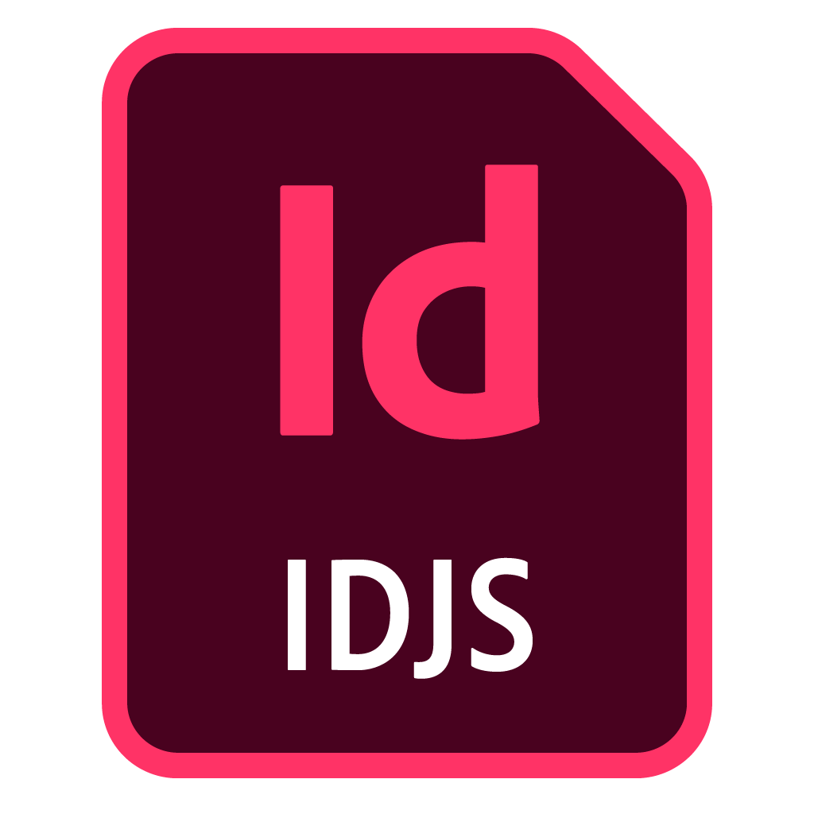

---
title: UXP Powered Scripts for InDesign
description: UXP Scripts Reference for InDesign
# openAPISpec:  /petstore.json
--- 

<TextBlock slots="image,heading,text,text" variantsTypePrimary='accent' variantStyleFill = "fill" homeZigZag position="left"  />

### UXP Scripts 

**InDesign v18.0** supports UXP scripts. 

They are the quickest and easiest way to extend the capabilities of your application. Read the introduction to [Scripts & Plugins](../../introduction/nex-steps/script-and-plugin/) to understand if scripts are the right fit for your use case before proceeding. 
