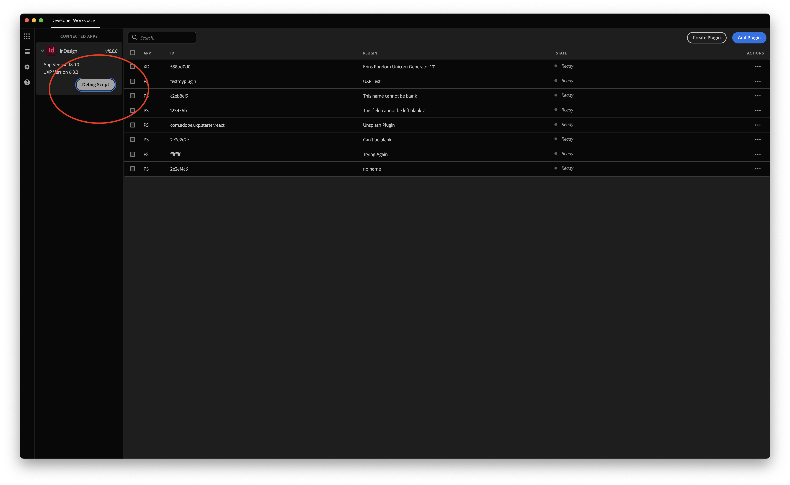
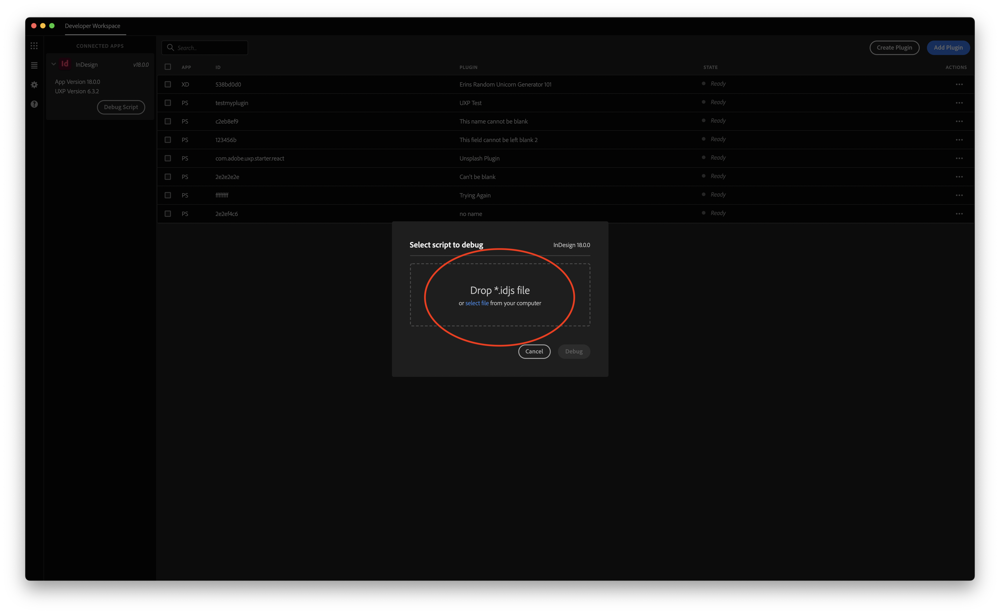

# Debugging a Script
This page goes over how to debug common problems you may run into.

Quick tips for logs:
* The UXP logs and `console.log` from scripts get written to the following locations   
  For the InDesign versions below 19.2 -    
    - macOS: `/Users/<user name>/Library/Caches/UXPLogs/`   
    - Windows: `C:\Users\<username>\AppData\Local\Temp\UXPLogs`   

  From InDesign 19.2 version onwards log paths have changed as below -   
    - Adobe InDesign -   
      macOS: `/Users/<user name>/Library/Logs/Adobe/Adobe InDesign <InDesign version year>/`   
      Windows: `C:\Users\<username>\AppData\Roaming\Adobe\InDesign\Logs`   
    - Adobe InDesign Server -   
      macOS: `/Users/<user name>/Library/Logs/Adobe/Adobe InDesign Server <InDesign version year>/`   
      Windows: `C:\Users\<username>\AppData\Roaming\Adobe\InDesign Server\Logs`   

  If you find multiple files in the location, pick the one with the latest timestamp.
* All the sample scripts have a try/catch block. Any exceptions raised from the InDesign side will be caught and dumped to the console or displayed on the dialog box.
* Interpreter parsing errors go directly to the UXP logs.

## Debugging Script files using UDT

Script files are executed in the same context as UXP plugins. Using [UXP Developer Tool](https://creativecloud.adobe.com/apps/download/uxp-developer-tools) (UDT) v1.7.0, you can step through and debug a script.

You can debug script files in UDT by clicking on "Connected Apps", choosing InDesign, and then adding your script from there:

Once you've loaded a script in, you can debug with a breakpoint activated. From here you set breakpoints or Step Into the script files. 