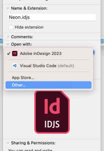
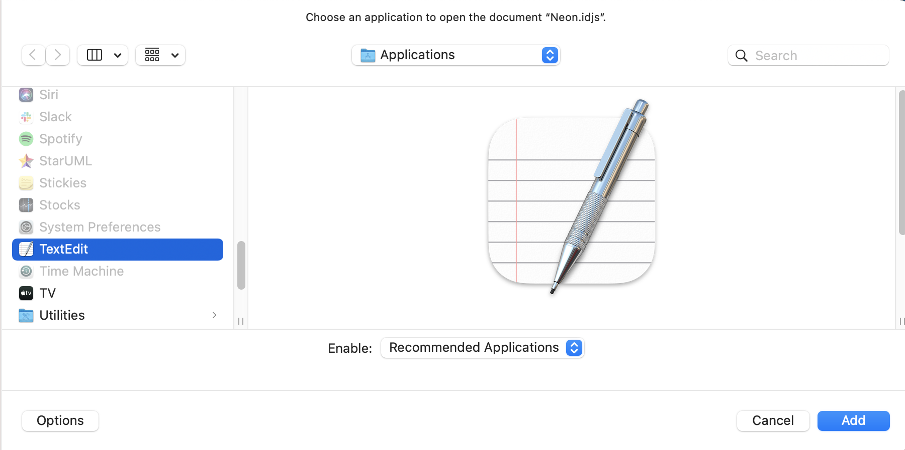

# Text-Editor Association for .idjs Files

This page goes over how to open your preferred text editor while creating InDesign scripts. 

When double-clicking an idjs (UXP Script) file for the first time, the user will see an alert asking them to associate UXP script files with a text-editor of their choice, so that subsequent double-clicks directly open scripting files in their preferred editor.

## Steps to achieve this on MacOS:

1. Right-click any .idjs-file
2. Click "Get Info"
3. Under "Open With",  select an editor of your choice from the application list 
4. If not visible in the list, click "Other" and select an editor from the "Applications" folder, and click "Add"
5. Click the button that says "Change All" and then "Continue".

## Steps to achieve this on Windows:

1. Right-click any .idjs-file
2. Click "Open with"
3. Select an editor of your choice from the application list 
4. If not visible in the list, click "Choose another app", and if needed, "More apps" → "Look for another app on this PC" 
5. Navigate to the directory containing the editor and select it
6. Enable "Always use this app to open .idjs files".

## Adding a keyboard shortcut

To add a keyboard shortcut for a script, choose Edit > Keyboard Shortcuts, select an editable shortcut set from the Set menu, then choose Product Area > Scripts. A list of the scripts in your Scripts panel appears. Select a script and assign a keyboard shortcut as you would for any other InDesign feature.