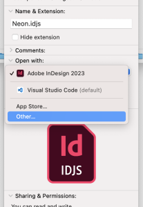
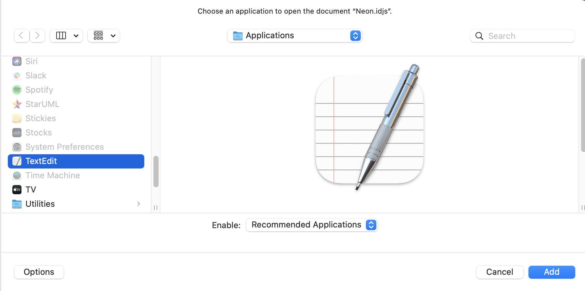
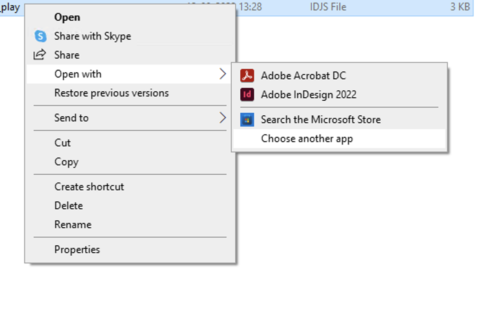
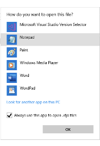

# Tips and tricks for UXP scripts
Additional tips and tricks that will help you while developing UXP Scripts.

## Scripts panel

The InDesign Scripts panel is the easiest and best way to run most InDesign scripts. If the panel is not already visible, you can display it by choosing Window > Utilities > Scripts.

### Editing scripts
To edit a script shown in the Scripts panel, select the script and choose Edit Script from the Scripts panel menu. Alternatively, you can hold down the Option (macOS) or Alt (Windows) key and double-click the script's name. This opens the script in the editor you defined for the script file type.

### Open folder
To open the folder containing a script shown in the Scripts panel, select the script and choose Reveal in Finder (macOS) or Reveal in Explorer (Windows). Alternatively, you can hold down the Command (macOS) or Ctrl-Shift (Windows) keys and double-click the script's name. The script folder opens in the Finder (macOS) or Explorer (Windows).

### Keyboard shortcuts

To add a keyboard shortcut for a script, choose Edit > Keyboard Shortcuts, select `[Default]` from the Set menu, then choose Product Area > Scripts. A list of the scripts in your Scripts panel appears. Select a script and assign a keyboard shortcut as you would for any other InDesign feature.

## Run script during application startup

To run a specific script when InDesign starts, put it inside a folder named "Startup Scripts" inside the Scripts folder
- macOS - `/Applications/Adobe InDesign 2023/Scripts/startup scripts`
- Windows - //TODO path?

Create this folder if it does not already exist.

## Associate a Text-Editor for .idjs Files

Associate idjs files to your preferred editor by following these steps:

### On Mac
1. Right-click any `.idjs` file
2. Click "Get Info"
3. Under "Open With",  select an editor of your choice from the application list 
4. If not visible in the list, click "Other", and select an editor from the "Applications" folder, and click "Add"
5. Click the button that says "Change All" and then "Continue".

### On Windows:
1. Right-click any `.idjs` file
2. Click "Open with"
3. Select an editor of your choice from the application list 
4. If not visible in the list, click "Choose another app", and if needed, "More apps" → "Look for another app on this PC" 
5. Navigate to the directory containing the editor and select it
6. Enable "Always use this app to open .idjs files".

